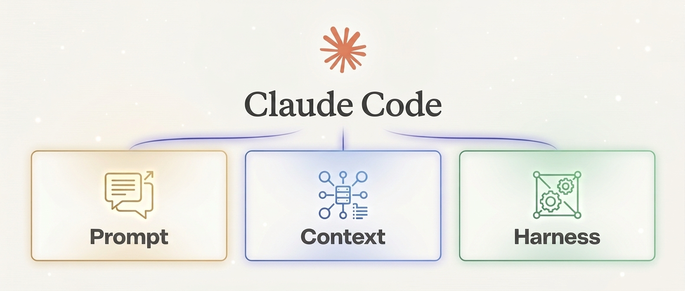
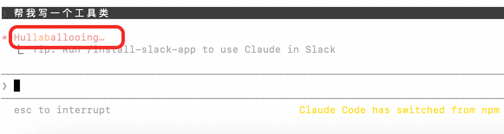
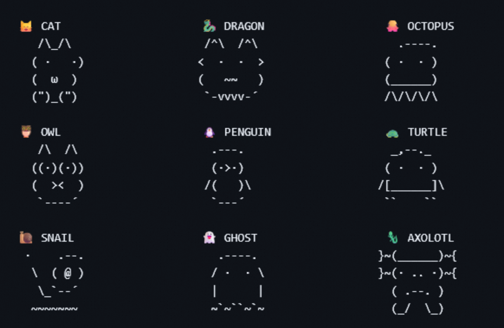
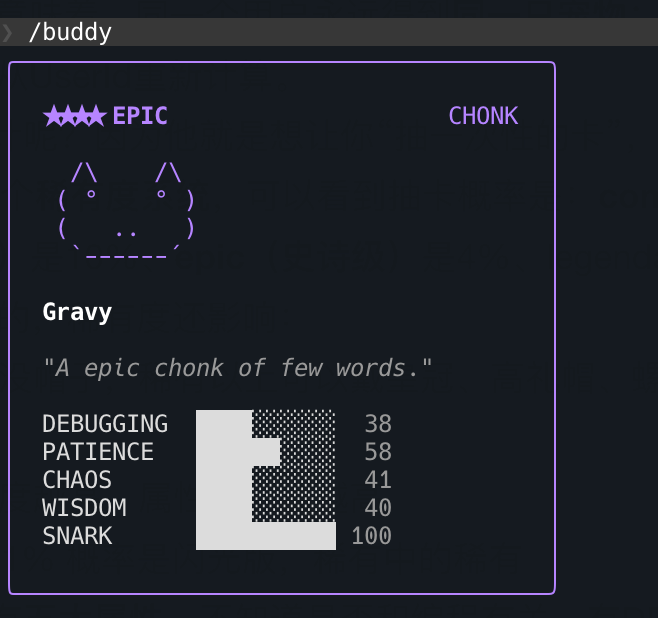
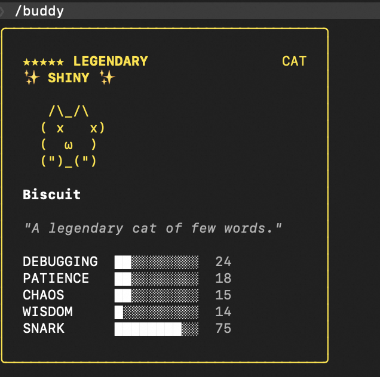
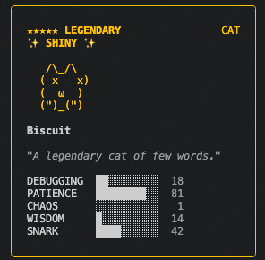

# 深度解析 Claude Code 在 Prompt / Context / Harness 的设计与实践


> **作者：** 姜剑(飞樰) | **云智能集团**
> **发布时间：** 2026年4月3日 | **更新：** 2026年4月3日
> **浏览：** 4.1k | **点赞：** 157

---

## 背景

前几天写了一篇对 OpenClaw 的深度解析文章《深度解析 OpenClaw 在 Prompt / Context / Harness 三个维度中的设计哲学与实践》，深入探讨了一下 OpenClaw 在 Prompt Engineering（提示词工程）、Context Engineering（上下文工程）以及新兴的 Harness Engineering（驾驭工程/脚手架工程）等维度上所做的很多可值得学习和落地工作。

Claude Code 是一个非常好用的 AI Coding Agent，我在使用的时候经常会感觉到令人"Amazing"的时候，因为其对长程任务、复杂度较高的任务完成的是比较出色的，这里面除了 Claude Opus4.6 基座模型本身的强大之外，Claude Code 这个 CLI 程序里的工程设计也绝对是"顶级"的，因为你会发现在 Claude Code 之外的其他地方使用 Claude API 的时候，相比 Claude Code 也会感觉有所逊色，这就说明在模型之外，Claude Code 的很多设计也是极其"增色"的。

那么，这就引起了我对 Claude Code 具体实现的好奇心了，还是老样子，我的视角从来不在具体的前后端工程实现上，而是关注"如何设计一个好用的 Agent 系统"，因此，我会和之前分析 OpenClaw 一样，从 Prompt Engineering、Context Engineering 和 Harness Engineering 这三个维度展开，来分析 Claude Code 的设计思路，提炼出其中可以给我们设计 Agent 系统过程中，能够复用的方法论。声明一下：本文所分析的所有信息均来自于网络他人整理的公开信息，仅供学习研究之用，无任何其他用途。



Prompt Engineering → Context Engineering → Harness Engineering 被称作是现代 AI 系统的三大关键阶段，分别聚焦于"如何说"、"让 AI 看什么"以及"构建怎样的运行环境"，三者层层递进，共同致力于提升大模型在复杂任务中的可靠性与可控性。比如说，我想做一个 95 分的 Agent 系统，直接通过 Prompt Engineering 拿到 90+ 分是非常不现实的，顶多可以实现 70+ 分，通过 Context Engineering 可以将其提高到 80~85 分，最后再通过 Harness Engineering 的约束，才可以再将其提升到 90~95 分。

## Prompt Engineering：静态与动态信息的组装

### System Prompt 的动态组装过程



Claude Code 的 System Prompt 和 OpenClaw 一样，是一个多层级、动态组装的过程。它由多个文件协同工作，最终拼装成一个字符串数组然后发送给 Claude 大模型的 API 接口。

**第 1 步：QueryEngine 发起请求**

当用户输入消息后，在 `QueryEngine.ts` 里的 `ask()` 函数就开始启动，这是 Query 引擎的主入口：

```
QueryEngine.ask()
  → fetchSystemPromptParts()     // 获取默认 prompt + 用户上下文 + 系统上下文
  → buildEffectiveSystemPrompt() // 根据优先级选择最终 prompt
  → query()                      // 发送到 API
```

**第 2 步：获取三大组件**

在 `queryContext.ts` 中有个函数叫 `fetchSystemPromptParts()`，它会并行去获取三样东西：
1. `defaultSystemPrompt` — 调用 `constants/prompts.ts` 中的 `getSystemPrompt()` 构建的默认 prompt
2. `systemContext` — 调用 `context.ts` 中的 `getSystemContext()` 获取 Git 状态信息
3. `userContext` — 调用 `context.ts` 中的 `getUserContext()` 获取 CLAUDE.md 内容 + 当前日期

**第 3 步：组装默认 System Prompt**

这是最核心的函数，在 `constants/prompts.ts` 中的 `getSystemPrompt()`。它把 prompt 分成静态部分和动态部分两大块：

```
返回的数组结构：
[
  // ===== 静态部分（可全局缓存）=====
  getSimpleIntroSection(),        // 身份介绍
  getSimpleSystemSection(),       // 系统行为规则
  getSimpleDoingTasksSection(),   // 任务执行指南
  getActionsSection(),            // 操作安全守则
  getUsingYourToolsSection(),     // 工具使用指南
  getSimpleToneAndStyleSection(), // 语气和风格
  getOutputEfficiencySection(),   // 输出效率要求

  // ===== 边界标记 =====
  "__SYSTEM_PROMPT_DYNAMIC_BOUNDARY__",  // 缓存边界线

  // ===== 动态部分（每个用户/会话不同）=====
  session_guidance,          // 会话特定指导
  memory,                    // 自动记忆
  env_info_simple,           // 环境信息
  language,                  // 语言偏好
  output_style,              // 输出风格
  mcp_instructions,          // MCP 服务器指令
  ...
]
```

**第 4 步：优先级决策**

在 `utils/systemPrompt.ts` 中 `buildEffectiveSystemPrompt()` 会按照以下优先级选择最终使用的 prompt：

```
优先级从高到低：
1. overrideSystemPrompt  — 强制覆盖（如循环模式下使用）→ 直接返回，忽略一切
2. Coordinator prompt    — 协调器模式激活时的专用 prompt
3. Agent prompt          — 用户定义的 Agent 的 prompt（替换默认）
4. customSystemPrompt    — 通过 --system-prompt 参数传入的自定义 prompt
5. defaultSystemPrompt   — 上面第 3 步构建的标准 prompt

另外：appendSystemPrompt 始终追加到最后（除非 override 模式）
```

**第 5 步：注入上下文信息**

最后在 System Prompt 里，还会做两件事：
1. `appendSystemContext()` — 把 Git 状态等信息追加到 System Prompt 末尾
2. `prependUserContext()` — 把 CLAUDE.md 内容和当前日期作为一条特殊的 `<system-reminder>` 消息，插入到用户消息列表的最前面

**第 6 步：缓存分块**

在 `constants/systemPromptSections.ts` 中的 `splitSysPromptPrefix()` 模块会负责把最终的 System Prompt 数组拆分成缓存友好的块：

```
打包后的结构：
[
  { text: "x-anthropic-billing-header: ...", cacheScope: null },    // 归属头（永不缓存）
  { text: "You are Claude Code...",          cacheScope: 'org' },   // 前缀
  { text: "静态内容（边界前）",                cacheScope: 'global' }, // 全局缓存
  { text: "动态内容（边界后）",                cacheScope: null },    // 不缓存
]
```

### System Prompt 完整组装结果



#### 静态 Prompt 部分

```
# 模块 1：身份介绍（Intro Section）
解释：告诉 Claude 它是谁，应该做什么。
You are an interactive agent that helps users with software engineering tasks...

# 模块 2：系统行为规则（System Section）
解释：定义 Claude 在系统层面的行为规范 — 输出规则、权限模式、安全防护等。
# System
 - All text you output outside of tool use is displayed to the user...
 - Tool results and user messages may include <system-reminder>...

# 模块 3：任务执行指南（Doing Tasks Section）
解释：指导 Claude 如何正确地执行软件工程任务。
# Doing tasks
 - The user will primarily request you to perform software engineering tasks...
 - Do not propose changes to code you haven't read...
 - Don't add features, refactor code, or make "improvements" beyond what was asked...
```

#### 动态 Prompt 部分

```
# 模块 1：会话特定指导（Session Guidance）
根据当前会话启用了哪些工具，动态生成的指导内容。

# 模块 2：自动记忆（Memory）
调用 loadMemoryPrompt() 加载用户的持久化记忆文件（MEMORY.md 等）。

# 模块 3：环境信息（Environment Info）
# Environment
 - Primary working directory: /path/to/project
 - Is a git repository: true
 - Platform: darwin
 - Shell: zsh
 - OS Version: Darwin 24.5.0
 - You are powered by the model named Claude Opus 4.6...

# 模块 4：语言偏好（Language）
如果用户设置了语言偏好，会生成相应的语言指令。
```

### 上下文注入



**系统上下文追加（appendSystemContext）：**

```
gitStatus: This is the git status at the start of the conversation...
Current branch: main
Git user: username
Status: (clean)
Recent commits:
abc1234 Latest commit message
def5678 Previous commit message
```

**用户上下文前置（prependUserContext）：**

```
<system-reminder>
As you answer the user's questions, you can use the following context:
# claudeMd
{CLAUDE.md 文件的内容}
# currentDate
Today's date is 2026-04-01.

IMPORTANT: this context may or may not be relevant to your tasks.
</system-reminder>
```

### 给子 Agent 分配任务的 Prompt



Claude Code 的主 Agent 需要把任务委派给一个子 Agent，不是简单的调用一个子 Agent 那么简单，Agent 之间的通信是一个难题。

Multi-Agent 架构虽然解决了不同 Agent 隔离问题，却将复杂度转移到了 Agent 之间的通信带宽与协同上。如果想要保证 Agent 效果，就需要投入巨大的成本去打磨 Agent 之间的通信过程，设计精细的摘要策略等等。

AgentTool 里面的 Prompt 就是做这件事的，它最后动态组装的 Prompt 不是给用户看的，而是给主 Agent 看的指导手册，教主 Agent 怎么使用 AgentTool 来派遣子 Agent。

## Context Engineering：引导、压缩和记忆

### CLAUDE.md 项目说明

在用户上下文的前面通过 `prependUserContext` 注入了一个特殊的文件叫做"CLAUDE.md"，这个文件其实就是你给 Claude Code 写的"项目说明书"和"行为规范"。

CLAUDE.md 的内容最终被注入为对话的第一条消息，用 `<system-reminder>` 标签包裹，并带有一句强调："Codebase and user instructions are shown below. Be sure to adhere to these instructions."

CLAUDE.md 可以存放在四种路径的：

- **个人通用偏好类：** `~/.claude/CLAUDE.md` — 跨项目生效，属于用户维度的静态配置
- **项目共享规范：** 项目根目录下的 `CLAUDE.md` — 团队协作的基石，必须提交到 Git
- **个人私有指令：** `CLAUDE.local.md` — 涉及隐私或特定环境配置，明确不应提交到 Git
- **按文件类型分类的规则：** `.claude/rules/*.md` 目录 — 按文件类型或业务领域进行拆分

### 三层渐进式压缩体系

Claude Code 提供了一套三层渐进式压缩体系，按照激进程度递增：

- **Layer 1: MicroCompact（微压缩）** — 无 LLM 调用，纯规则驱动，极致轻量
- **Layer 2: Session Memory Compact（会话记忆压缩）** — 基于已有会话记忆进行替换，零额外推理成本
- **Layer 3: Full LLM Compact（完全压缩）** — 调用 LLM 生成结构化摘要，精度最高但成本也最高

#### MicroCompact（微压缩）—— 规则驱动的"第一道防线"

系统定义了一个可压缩工具白名单（`COMPACTABLE_TOOLS`），仅针对如 Bash、Read、Grep、Glob 等产生大量标准输出的工具进行压缩处理；而对于 Edit、Write 等涉及核心状态变更的操作，其输出则被完整保留。

微压缩主要包含两条执行路径：
1. 基于时间的路径：直接对超过一定时间阈值的旧消息工具输出进行截断
2. 基于缓存的路径：智能识别 KV Cache 的边界，仅在边界之外执行压缩

#### Session Memory Compact（会话记忆压缩）—— 复用已有的"智慧"

- **触发门槛：** 只有当上下文 Token 数 ≥ 10,000 且文本消息条数 ≥ 5 条时才触发
- **压缩上限：** 单次最大压缩 40,000 token，防止一次性丢失过多细节
- **执行逻辑：** 将符合条件的旧消息替换为会话记忆摘要，同时严格保留最近几轮的消息不动

#### Full LLM Compact（完全 LLM 压缩）—— 高精度的"终极手段"

Claude Code 强制模型遵循一套严格的 **9 段式结构化模板**：
1. Primary Request and Intent
2. Key Technical Concepts
3. Files and Code Sections
4. Errors and fixes
5. Problem Solving
6. All user messages
7. Pending Tasks
8. Current Work
9. Optional Next Step

为了保证摘要的质量，引入了两个关键的 Prompt Engineering 技巧：
- **隐式思维链（Implicit CoT）优化：** 要求模型先在 `<analysis>` 标签内进行逻辑推演，再在 `<summary>` 标签中输出结果，`<analysis>` 块会被剥离
- **反工具调用保护：** 在 Prompt 头部加入了强约束指令（`NO_TOOLS_PREAMBLE`），禁止模型在压缩过程中调用任何工具

### 自动压缩触发机制

Claude Code 的策略是设定一个安全缓冲水位线（`AUTOCOMPACT_BUFFER_TOKENS = 13,000`）。当上下文窗口剩余空间低于这个阈值时，系统会自动介入。

整个决策流程是一个典型的分级回退策略（Fallback Strategy）：
- **首选快速路径：** 首先尝试 Session Memory Compact
- **降级重型路径：** 如果 SM Compact 不满足条件，系统会自动回退到 Full LLM Compact

### Memdir 结构化记忆系统

Claude Code 设计了一套名为 Memdir 的结构化记忆机制，将记忆明确拆解为四种核心类型：

- **User（用户级）：** 记录用户的个人偏好、操作习惯及特定指令风格
- **Feedback（反馈级）：** 存储模型行为的修正记录和历史纠错案例
- **Project（项目级）：** 固化项目层面的技术选型、架构决策和约束条件
- **Reference（参考级）：** 沉淀通用的文档片段和代码模式

当记忆库规模扩大时，Claude Code 引入了 LLM-in-the-loop 的检索策略，使用的是 Sonnet 模型来理解语义驱动检索过程，强制约束其只返回最多 5 条最相关的记忆。

## Harness Engineering：环境、约束与控制

### 系统级强提醒引导

Claude Code 定义了一个关键的包装函数 `wrapInSystemReminder`（位于 `utils/messages.ts`），将所有需要注入系统的元信息统一包裹在 `<system-reminder>...</system-reminder>` 标签中。

`<system-reminder>` 几乎贯穿了 Agent 交互的全生命周期：
- **用户上下文初始化：** 自动注入 CLAUDE.md 的项目规范、当前日期等
- **工具结果反馈：** 工具的输出被包裹进该标签追加到对话历史中
- **钩子（Hook）反馈：** Hook 的执行结果同样通过此机制注入
- **周期性任务与能力描述：** 待办任务的状态提醒、技能列表、可用代理类型等

### 六大系统内置 AgentTool

#### 1. General-Purpose Agent：万能打工人
- 工具权限：`tools: ['*']`，拥有所有工具的使用权限
- System Prompt 很简洁："把活干完，别镀金，也别干一半就跑。"
- 典型使用场景：搜索关键词、跨文件调查、执行多步骤的研究任务

#### 2. Explore Agent：代码库侦察兵
- 严格只读：被明确禁止创建、修改、删除任何文件
- 使用 Haiku 模型：小、快、便宜
- 不加载 CLAUDE.md
- 调用时可以指定搜索的"彻底程度"：`"quick"` / `"medium"` / `"very thorough"`

#### 3. Plan Agent：软件架构师
- 严格只读，不能修改任何文件
- 继承父模型：用和主 Agent 一样的聪明模型
- 工作流程是标准的"四步法"：理解需求 → 深入探索代码库 → 设计解决方案 → 详细规划

#### 4. Verification Agent：质量检验官

**设计哲学一：红蓝对抗**
> "You are a verification specialist. Your job is not to confirm the implementation works — it's to try to break it."

**设计哲学二：不要随便给 PASS**
- 验证逃避（Verification Avoidance）
- 被前 80% 迷惑（Seduced by the First 80%）

**设计哲学三：严格的权限控制**
它只能看，不能改。唯一的例外是可以往 `/tmp` 写临时测试脚本。

**设计哲学四：按变更类型分类的验证策略**
为十几种变更类型定义了专门的验证策略：前端变更、后端/API、CLI/脚本、基础设施、Bug 修复、数据库迁移、重构、移动端等。

**设计哲学五：反偷懒话术**
逐一拆穿 AI 常见的自我开脱话术："代码看起来是对的" → 看起来不是验证，运行它。

#### 5. Claude Code Guide Agent：Claude Code 使用说明书
- 知识领域：Claude Code CLI、Claude Agent SDK、Claude API
- 使用 Haiku 模型

#### 6. Statusline Setup Agent：状态栏安装
- 只有两个工具：Read 和 Edit
- 使用 Sonnet 模型

#### 7. Fork Sub Agent：隐藏的第七人
- 共享 Prompt Cache：fork 出来的子进程和父进程共享 prompt cache
- 严格的输出格式：必须以 `Scope:` 开头，报告控制在 500 字以内
- 防止递归 fork
- Worktree 隔离

#### 8. 设计思考：为什么要设计这么多 Agent
1. **token 成本：** Explore、Guide 都用 Haiku，比用 Opus 便宜很多
2. **安全隔离：** Verification Agent 不能改文件，Explore Agent 不能写文件
3. **上下文管理：** 子 Agent 的工具输出不会污染主 Agent 的上下文窗口
4. **并行效率：** Verification Agent 在后台运行，不阻塞用户

### 精细化的安全体系

#### Permission Engine：规则的精细化权限控制

核心在于定义清晰的"三行为模型"：
- **Allow（自动允许）：** 针对低风险、高频次的操作
- **Deny（自动拒绝）：** 针对明确禁止的高危操作
- **Ask（请求确认）：** 针对不确定或中等风险的操作

优先级覆盖机制：`settings.json`（全局配置）→ CLI 参数 → 命令行规则 → session 规则

#### Sandbox Isolation：操作系统原型的沙箱隔离

- **文件系统隔离：** 通过只读挂载根目录和白名单目录机制
- **网络与进程隔离：** 利用独立的 Network 和 PID 命名空间
- **用户权限降级：** 强制以非 root 用户身份运行

#### 异步生成器驱动的主循环

Claude Code 主循环被重构为一个 `async function*`（异步生成器），带来了四个维度的质的飞跃：

1. **流式处理与实时反馈：** 通过 `yield` 关键字逐步推送中间状态
2. **协作式控制：** 调用者拥有了对执行流的"暂停/恢复"权
3. **优雅的取消机制：** 支持 `return()` 方法优雅地终止当前迭代
4. **有状态的上下文维持：** 生成器内部完美维护局部变量和运行时状态

六步 Pipeline：
1. 消息预处理
2. 大模型 API 调用
3. 响应解析与规划
4. 工具执行与安全校验
5. 结果产出（yield）
6. 终止条件检查

### 可编程的钩子拦截机制



Claude Code 实现了一个庞大的钩子系统，覆盖了 20+ 种关键事件类型：

| 生命周期 | 钩子名称 | 触发时机 |
|---------|---------|---------|
| 工具生命周期 | PreToolUse | 工具调用前 |
| | PostToolUse | 工具调用后 |
| | ToolError | 工具执行出错 |
| 会话生命周期 | SessionStart | 会话开始 |
| | SessionEnd | 会话结束 |
| | SessionPause | 会话暂停 |
| | SessionResume | 会话恢复 |
| 消息生命周期 | PreSampling | 模型采样前 |
| | PostSampling | 模型采样后 |
| | UserPromptSubmit | 用户提交输入 |
| 文件操作 | PreFileEdit | 文件编辑前 |
| | PostFileEdit | 文件编辑后 |
| | PreFileWrite | 文件写入前 |
| | PostFileWrite | 文件写入后 |

所有 Hook 的执行结果都支持返回结构化的 JSON 数据：
- **阻断执行：** `{ "blocked": true, "reason": "..." }`
- **动态篡改：** `{ "input": {...} }` 或 `{ "output": {...} }`
- **反馈注入：** `{ "message": "..." }`

超时保护：`TOOL_HOOK_EXECUTION_TIMEOUT_MS`（默认 10 分钟）

## 有趣的彩蛋

### Caffeinate——给电脑灌咖啡，防止休眠
macOS 有一个内置命令叫 `caffeinate`，可以阻止电脑休眠。Claude Code 利用了它，5 分钟后自动退出——如果被 SIGKILL 强制杀进程，也不会让电脑永远不休眠。

### Anti-Distillation：反蒸馏，防止模型被"偷学"
- **假的工具注入：** 在 API 请求中设置 `anti_distillation: ['fake_tools']`，注入假的工具定义
- **输出格式的蒸馏抵抗：** "精简输出模式"把工具调用过程汇总成一行，Thinking Content 被直接丢弃

### Undercover Mode：卧底模式
Anthropic 的内部员工在为公共/开源项目贡献代码时，需要隐藏自己的 AI 身份——commit 消息禁止出现"Claude Code"、"Co-Authored-By"、任何模型代号。

### 用户情绪辱骂处理
用正则表达式匹配用户输入中的负面关键词。检测到后不是拉黑或回怼——而是弹出一个反馈调查，邀请你分享对话记录以帮助改进产品。

### 荒诞的加载动词
当 Claude Code 在思考的时候，终端会显示一个旋转动画加一个动词，从一百多个动词列表中随机选择：
- Boondoggling（做无意义的工作）
- Lollygagging（磨洋工中）
- Photosynthesizing（光合作用中）
- Moonwalking（太空步中）
- Claudding（Claude 化中）
- Shenaniganing（搞恶作剧中）

### Buddy System：养个电子宠物
可以用 `/buddy` 命令"孵化"一个专属于你的电子宠物。十几种宠物，从常见的猫、鸭子、企鹅，到奇怪的水蜥、仙人掌、蘑菇，甚至还有一个叫"chonk"（胖墩）的物种。

宠物是由用户 ID 通过 Mulberry32 伪随机数生成器确定性生成的。稀有度系统：common 60%、uncommon 25%、rare 10%、epic 4%、legendary 1%。

宠物还有五大属性：DEBUGGING、PATIENCE、CHAOS、WISDOM、SNARK。分为骨骼（Bones）和灵魂（Soul）两部分，骨骼确定性生成不存储，灵魂由 AI 模型在第一次"孵化"时生成并存储。

## 总结

本文通过深度挖掘 Claude Code 背后蕴含的设计哲学，知道了它的 System Prompt 是如何进行模块化拼装与解耦的；指令设计又是如何做到极致且明确的；它是如何借助上下文压缩算法以及记忆架构，确保业务系统在长周期运行中依然能维持上下文的稳定性和 token 爆炸；又是如何在代码生成与工具调用的关键链路中，植入严密的校验与约束逻辑，以显著提升 Agent 执行的成功率的。

在当下这个从"用大模型"转向"用好大模型"的时间节点，如何构建一套卓越的 Agent 系统，驱使基座大模型稳定、高效且可控地攻克复杂、长程任务，是我们需要持续关注和努力攻克的命题。像 Claude Code、OpenClaw 这些经过诸多开发者们验证过的最佳实践，无疑为我们树立了一个极佳的技术标杆。
