# Claude Code 源码深度架构分析

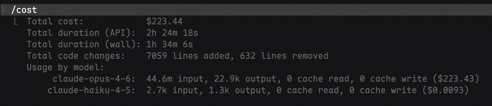

> **作者：** 刘镇东(毅宸) | **云智能集团**
> **发布时间：** 2026年3月31日 | **更新：** 2026年4月1日
> **浏览：** 13k | **点赞：** 821
> **基于：** @anthropic-ai/claude-code v2.1.88 源码（51 万行 TypeScript，1902 个文件）

---

## 一、项目全景与设计哲学

### 1.1 代码规模

| 模块 | 行数 | 占比 | 核心职责 |
|------|------|------|---------|
| utils | 180,472 | 35.2% | 权限、bash 安全、消息处理、git、MCP 等基础设施 |
| components | 81,546 | 15.9% | React 终端 UI 组件（权限对话框、diff、消息渲染） |
| services | 53,680 | 10.5% | API 调用、压缩、MCP 客户端、分析、OAuth |
| tools | 50,828 | 9.9% | 40+ 工具实现（Bash、FileEdit、Agent、MCP 等） |
| commands | 26,428 | 5.2% | 90+ 斜杠命令（/compact、/model、/mcp 等） |
| ink | 19,842 | 3.9% | 自研 Ink Fork（React 终端渲染引擎） |
| hooks | 19,204 | 3.7% | React hooks（权限处理、IDE 集成、语音等） |
| bridge | 12,613 | 2.5% | 远程控制（本地机器作为 bridge 环境） |
| cli | 12,353 | 2.4% | CLI 参数解析、后台会话管理 |

### 1.3 五条设计原则

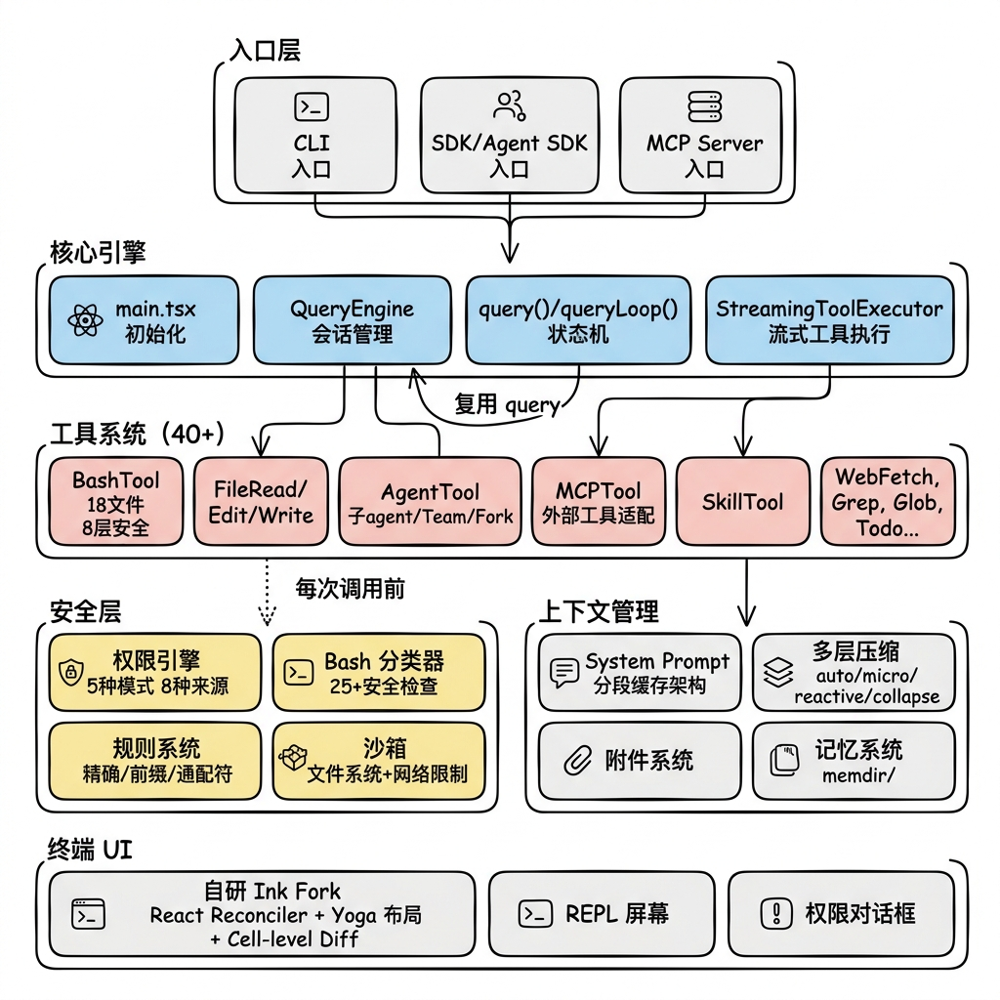

1. **工具即能力边界：** agent 能做什么完全由工具集决定，没有后门。新增能力 = 新增工具。
2. **Fail-closed 安全默认：** 所有安全相关的默认值都是最保守的——工具默认不可并行、默认非只读、权限默认需要确认。
3. **Context Engineering > Prompt Engineering：** 在每轮对话中精心组装完整的上下文环境——分段缓存、动态注入、多层压缩。
4. **可组合性：** 子 agent 复用主 agent 的 query() 函数，MCP 工具复用内部权限检查。
5. **编译时消除 > 运行时判断：** 通过 Bun 的 feature() 宏在构建时移除未启用的功能代码。

## 二、Agent Loop：系统的心脏

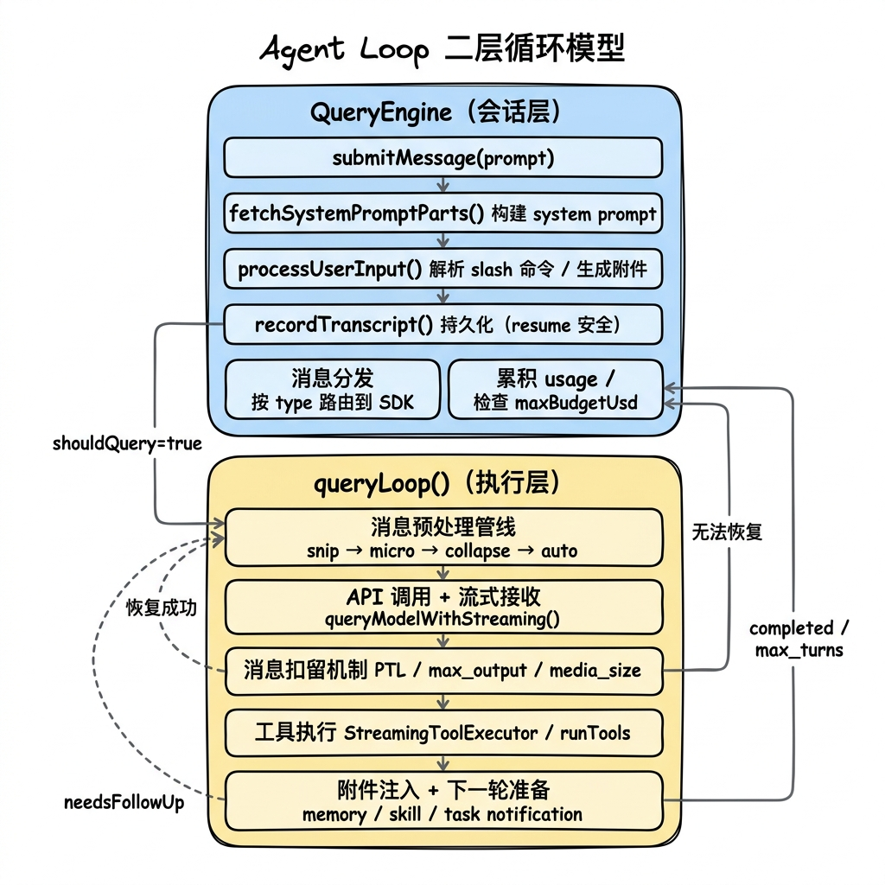

### 2.1 两层循环模型

Claude Code 的 Agent Loop 不是一个简单的 while 循环，而是一个有 7 种恢复路径和 10 种终止条件的隐式状态机，分为两层：

- **QueryEngine：** 处理"会话管理"——多轮状态、transcript 持久化、SDK 协议适配、usage 累积
- **queryLoop：** 处理"单轮执行"——API 调用、工具执行、错误恢复

两者通过 AsyncGenerator 连接：queryLoop yield 消息，QueryEngine 消费并转发。

**为什么用 AsyncGenerator？**
1. **背压：** 调用方按需消费，不会被消息洪水淹没
2. **中断语义：** generator 的 `.return()` 级联关闭所有嵌套 generator
3. **流式组合：** 子 agent 的 `runAgent()` 也是 AsyncGenerator，可以直接嵌套

### 2.2 queryLoop 的状态机设计

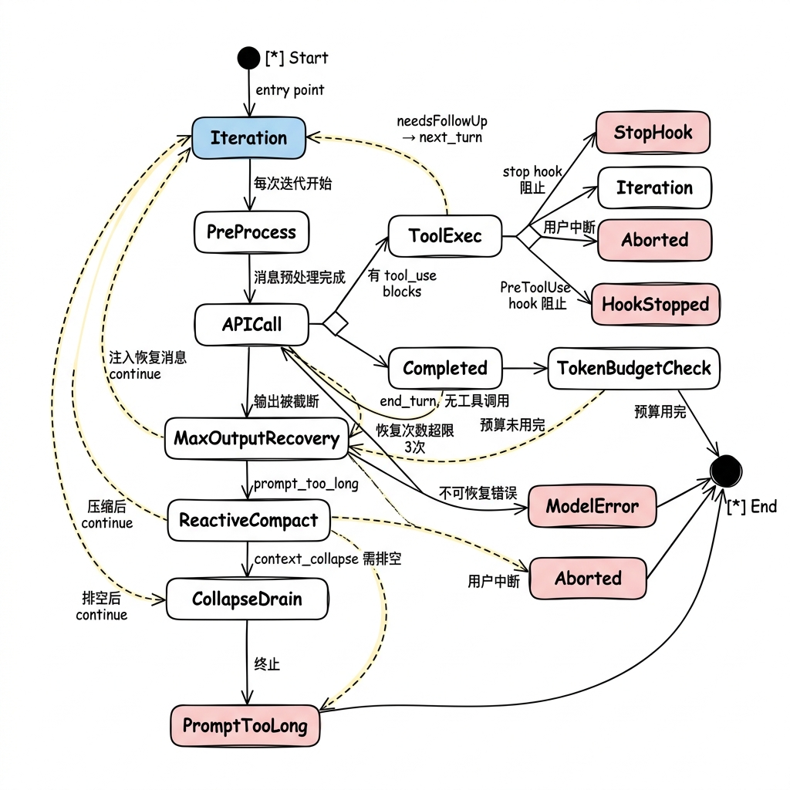

queryLoop 是一个 `while(true)` 循环，每次迭代代表一次"API 调用 + 工具执行"。循环的退出由两种类型决定：
- **Terminal：** 循环结束，返回终止原因
- **Continue：** 循环继续，通过 `state = next; continue` 跳到下一次迭代

通过 State 结构体追踪状态：

```typescript
type State = {
  messages: Message[]
  toolUseContext: ToolUseContext
  autoCompactTracking: AutoCompactTrackingState | undefined
  maxOutputTokensRecoveryCount: number
  hasAttemptedReactiveCompact: boolean
  pendingToolUseSummary: Promise<ToolUseSummaryMessage | null> | undefined
  turnCount: number
  transition: Continue | undefined  // 上一次迭代为什么 continue
}
```

### 2.3 消息预处理管线：从轻到重

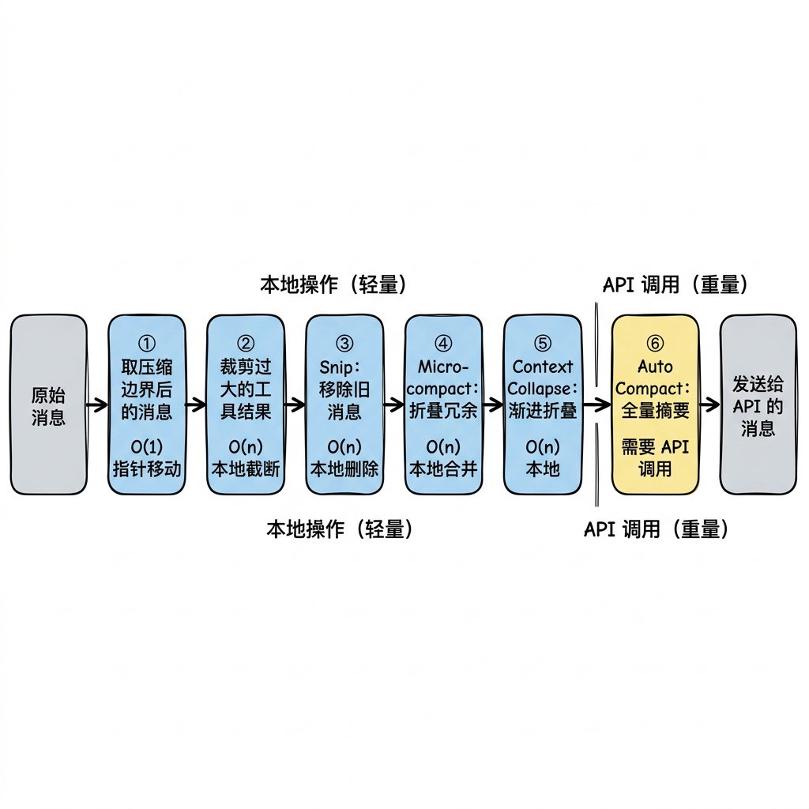

每次 API 调用前，消息要经过一条多阶段处理管线。遵循"从轻到重"原则——先做廉价的本地操作，再做需要 API 调用的重操作：

1. **Snip Compact** — 按 boundary 裁剪历史
2. **Micro Compact** — 微粒度压缩（按 tool_use_id）
3. **Context Collapse** — AST 级上下文折叠
4. **Tool Result Budget** — 大结果落盘，发送预览
5. **Auto Compact** — 对话摘要压缩

**AutoCompact 的阈值计算：** 有效上下文窗口 = 模型上下文窗口 - max(max_output_tokens, 20000)，触发阈值 = 有效上下文窗口 - 13000。

AutoCompact 有**断路器机制**——连续失败 3 次后停止重试。1,279 sessions 有 50+ 次连续失败（最多 3,272 次），浪费约 25 万次 API 调用/天。

### 2.4 流式工具执行器：并发控制的精髓

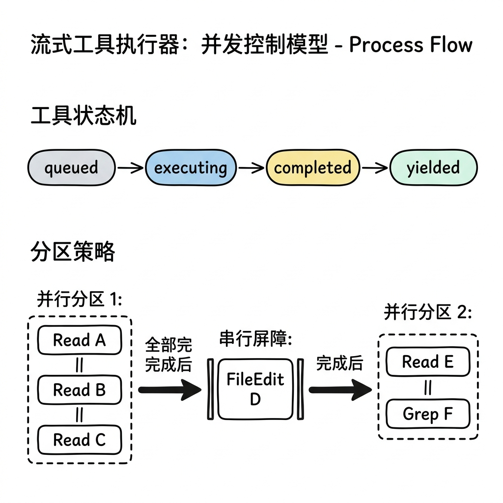

当模型返回多个工具调用时，如何执行？Claude Code 提供了两种模式：

- **批量执行：** 等 API 流式接收完全结束，然后按顺序执行所有工具
- **流式执行（StreamingToolExecutor）：** 每收到一个 tool_use block 就立即开始执行（默认模式）

**并发控制模型：**
- 每个工具通过 `isConcurrencySafe(input)` 声明自己是否可以并行执行
- 连续的并发安全工具组成一个"并行分区"，遇到非并发安全工具就开始新分区
- 分区间串行执行，分区内并行执行

**为什么 FileRead 是并发安全的而 FileEdit 不是？** 因为两个并行的 FileEdit 可能编辑同一个文件的不同位置，导致行号偏移和冲突。

### 2.5 消息扣留机制：保护 SDK 消费者

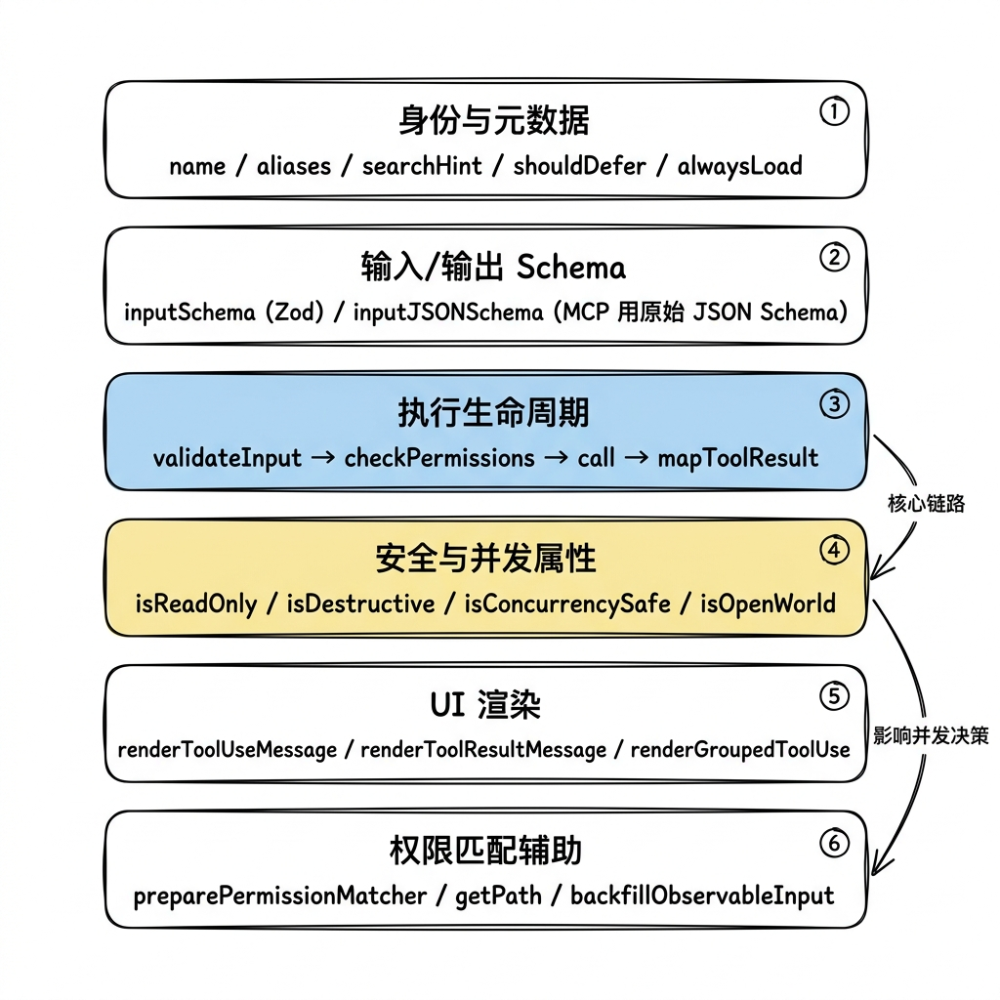

三类消息会被"扣留"：
1. **prompt-too-long 错误：** 被 reactiveCompact 扣留，尝试压缩后重试
2. **media-size 错误：** 尝试剥离过大的图片后重试
3. **max_output_tokens 错误：** 等待恢复循环决定是否能继续

### 2.6 Token Budget：让模型"做完"复杂任务

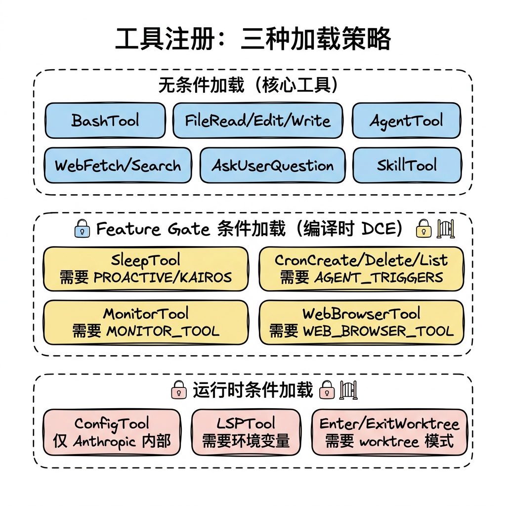

当模型自然停止（end_turn）但 token 预算未用完时，系统会注入一条 nudge 消息让模型继续工作。

**递减收益检测防止无限循环：** 如果连续 3 次检查每次增量都 < 500 tokens，说明模型已经没有实质性工作要做了，停止继续。

## 三、工具系统：Agent 的手与脚

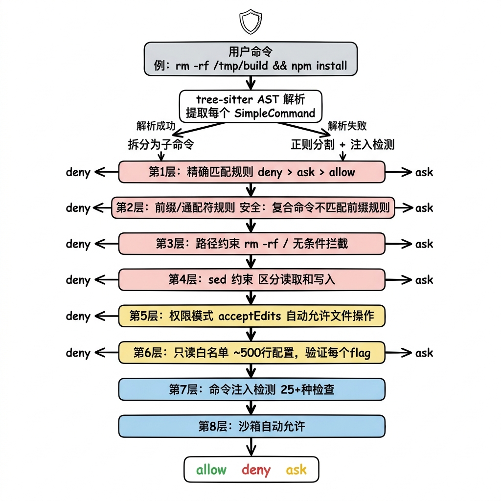

### 3.1 Tool 接口：六个功能组

Tool 类型是一个包含 30+ 方法的泛型接口。关键默认值设计：

| 属性 | 默认值 | 设计动机 |
|------|--------|---------|
| isConcurrencySafe | false | 假设不能并行，防止并发冲突 |
| isReadOnly | false | 假设会写入，触发更严格的权限检查 |
| isDestructive | false | 不假设破坏性，避免过度警告 |
| checkPermissions | allow | 默认放行，由外层权限系统兜底 |

### 3.2 ToolUseContext：工具的运行时环境

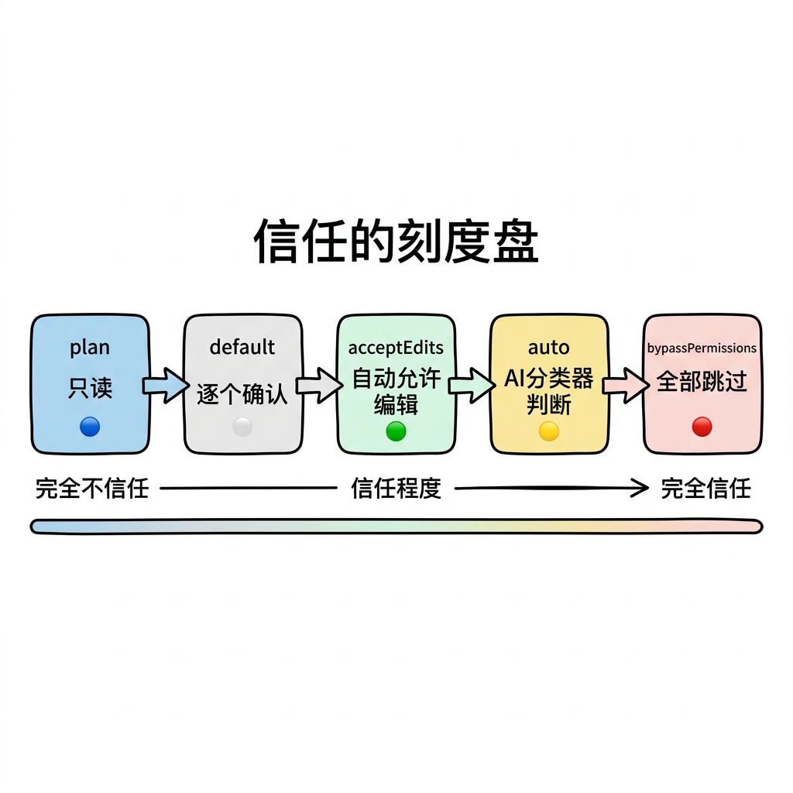

每个工具的 `call()` 方法接收一个 ToolUseContext 对象，包含 40+ 个字段：

| 上下文字段 | 用途 | 为什么不能省略 |
|-----------|------|--------------|
| readFileState | 文件读取状态缓存 | FileEditTool 需要验证"不能编辑未读过的文件" |
| abortController | 取消信号 | BashTool 的长时间命令需要支持用户中断 |
| setToolJSX | UI 渲染回调 | BashTool 需要渲染实时进度条 |
| agentId | 子 agent 标识 | 区分主线程和子 agent，影响权限和 CWD |
| updateFileHistoryState | 文件历史 | 支持 /rewind 命令撤销文件修改 |

### 3.4 BashTool 深度解析：18 个文件的安全堡垒

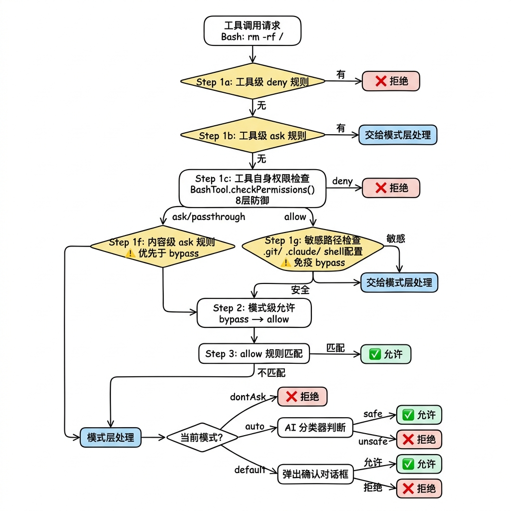

**复合命令隔离：** `Bash(cd:*)` 前缀规则。系统先用 tree-sitter 解析 AST，提取每个 SimpleCommand，对每个子命令独立运行权限检查。任何子命令被 deny，整个命令被 deny。子命令数量上限 50。

**只读白名单的 flag 级验证：** 不只检查命令名，还验证每个 flag 的值类型。比如 `xargs -I` 和 `-i` 看起来相似，但 `-i` 的 GNU 实现有可选参数语义，可以被利用执行任意命令。

**命令注入检测（bashSecurity.ts）：** 25+ 种检查，覆盖命令替换（`$()`、反引号）、进程替换（`<()`）、参数替换（`${}`）、Zsh 特有危险命令等。

### 3.5 FileEditTool：搜索-替换的安全设计

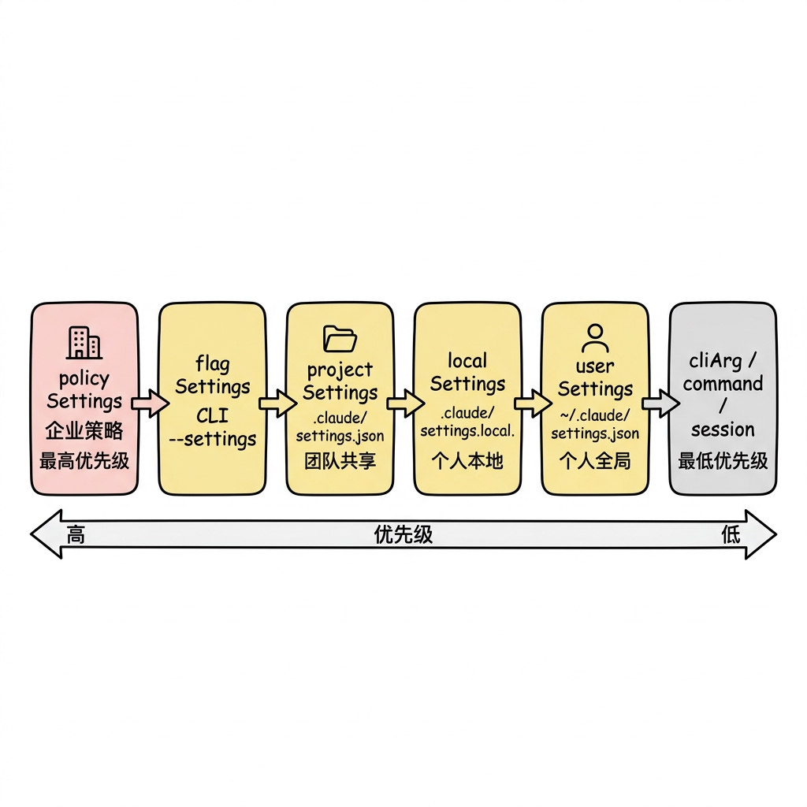

**核心约束：** `old_string` 必须在文件中唯一匹配。如果有多处匹配，编辑失败并要求提供更多上下文。

**安全不变量：** 不能编辑未读过的文件。`readFileState` 缓存跟踪哪些文件被读取过，如果模型试图编辑未读文件，系统拒绝并提示先读取。

## 四、权限体系：系统的免疫系统

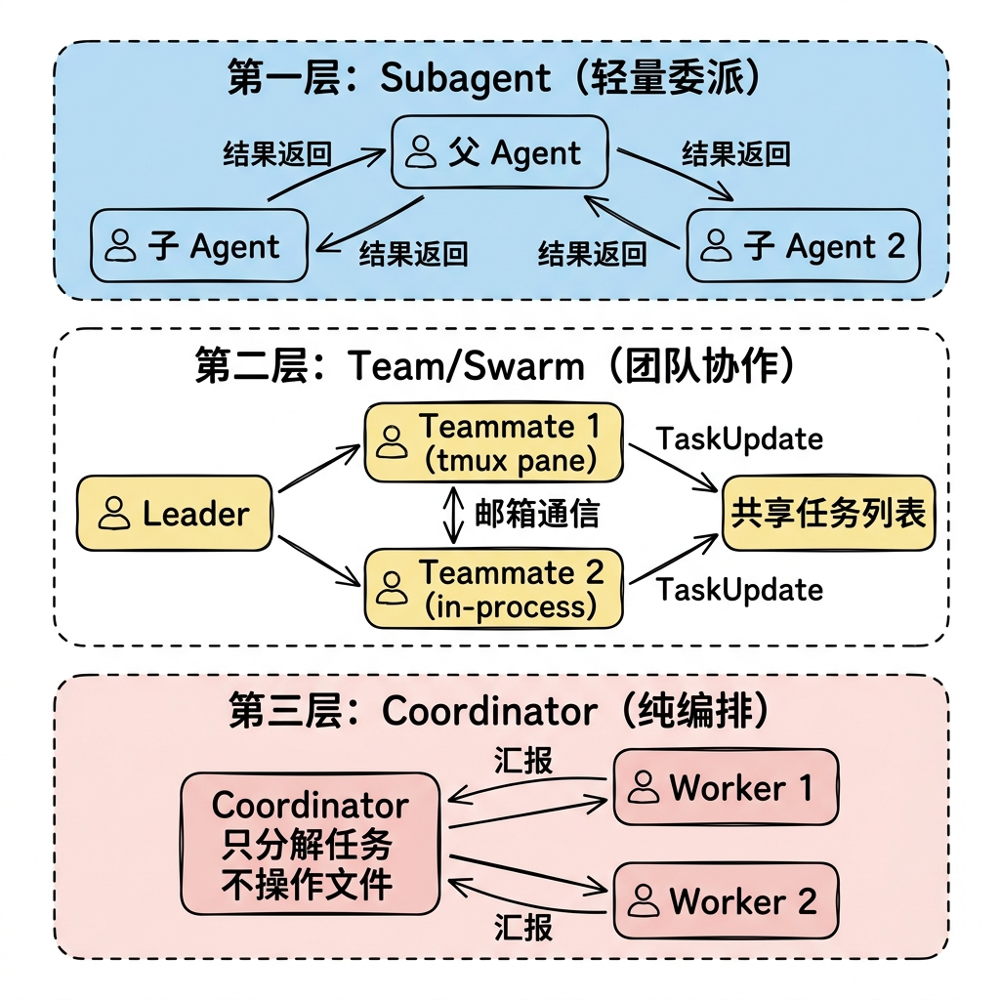

### 4.1 权限模式：信任的刻度盘

| 模式 | 行为 | 适用场景 |
|------|------|---------|
| plan | AI 只能规划，不能执行任何写操作 | 探索性分析、代码审查 |
| default | 每个工具调用都需要用户确认 | 日常开发（默认） |
| acceptEdits | 工作目录内的文件编辑自动允许 | 信任 AI 的重构能力 |
| auto | AI 分类器自动判断操作安全性 | 高信任场景（仅内部用户） |
| bypassPermissions | 跳过所有权限检查（除硬编码安全检查） | 紧急修复、受控环境 |
| dontAsk | 将所有 'ask' 转为 'deny' | 完全自动化的 CI/CD |

**远程熔断：** 即使用户选择了 bypassPermissions，系统仍保留远程禁用的能力。通过 Statsig 特性门控实现"紧急刹车"。

### 4.2 权限判断主流程：多层评估管线

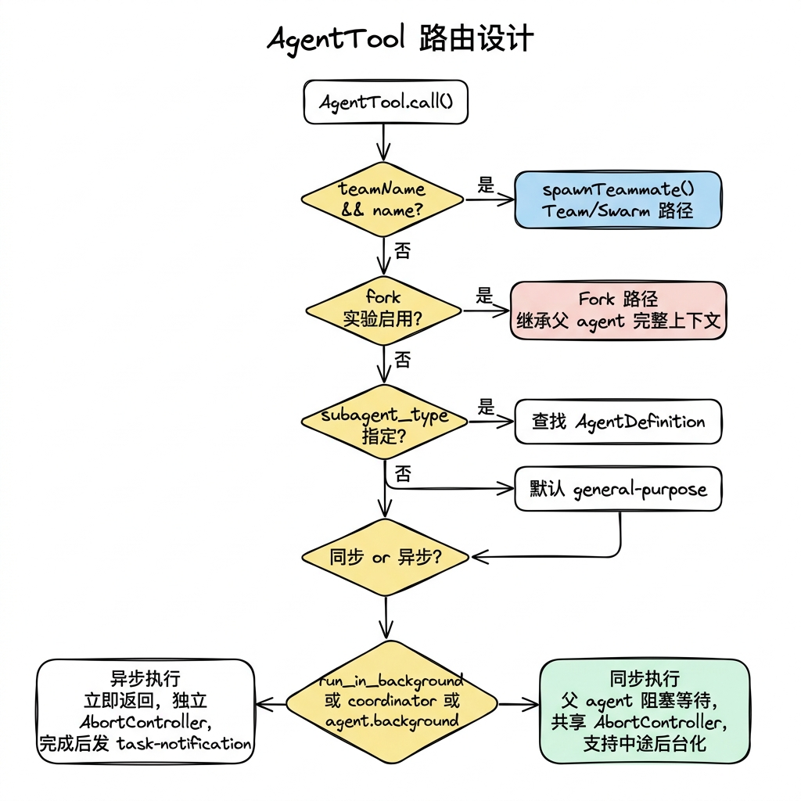

关键设计决策：
- **用户显式 ask 规则优先于 bypass 模式：** 用户的显式意图永远优先
- **敏感路径免疫 bypass：** 对 `.git/`、`.claude/`、`.vscode/`、shell 配置文件的写入，即使在 bypass 模式下也必须确认

### 4.3 规则系统：精细化控制

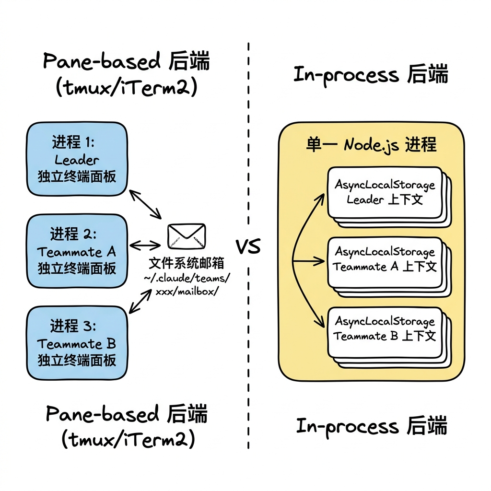

每条权限规则由三个维度定义：
- **来源（source）：** settings.json、CLI 参数、项目设置、session 规则
- **匹配模式：** 精确匹配、前缀匹配、通配符匹配
- **行为（behavior）：** allow、deny、ask

**规则遮蔽检测：** 当用户同时配置了矛盾的规则时，某些规则可能永远不会生效。系统会在 UI 中显示警告帮助用户修复。

### 4.4 权限在多 Agent 场景下的传递

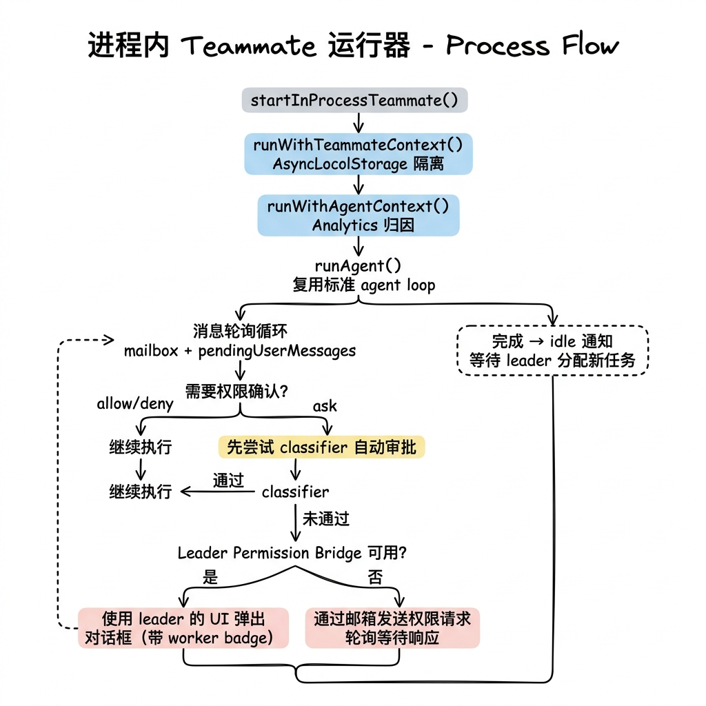

| 处理器 | 场景 | 行为 |
|--------|------|------|
| interactiveHandler | 标准交互模式 | 弹出 UI 对话框让用户决定 |
| coordinatorHandler | Coordinator 模式 | 先运行自动化检查，再决定是否需要用户确认 |
| swarmWorkerHandler | Swarm worker 模式 | 通过 Leader Permission Bridge 将权限请求冒泡到 leader |

## 五、多 Agent 协作：蜂群智能

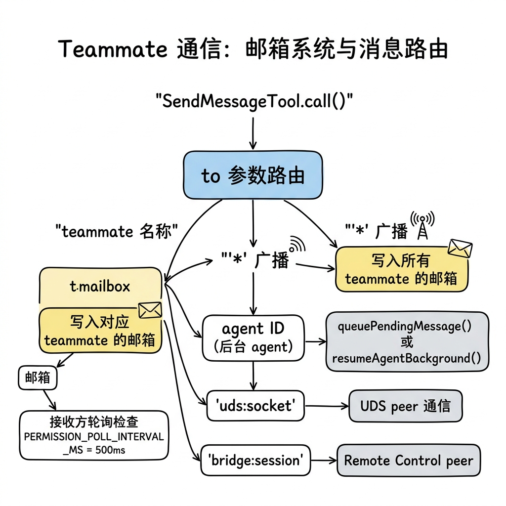

### 5.1 三层协作架构

- **Subagent：** 最轻量，父 agent 同步/异步派生子 agent
- **Team/Swarm：** 成员之间可以互相通信，有 leader/teammate 角色分工
- **Coordinator：** 纯编排模式，coordinator 不直接操作文件，所有实际工作由 worker 完成

### 5.2 AgentTool：统一入口的路由设计

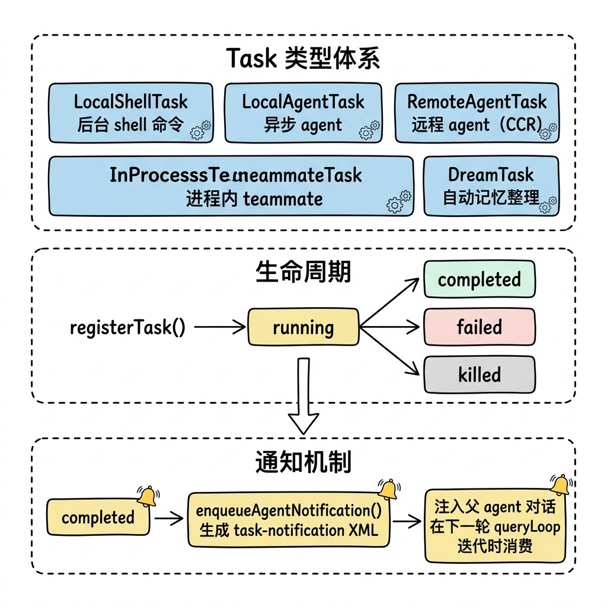

所有多 agent 协作都通过同一个工具触发——AgentTool。这个设计降低了模型的认知负担。

### 5.4 内置 Agent 类型的设计哲学

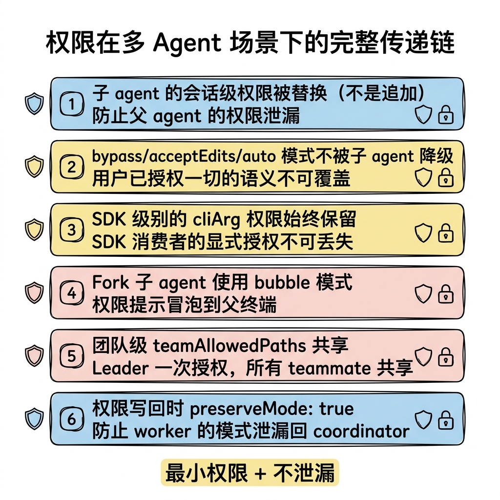

| Agent | 模型 | 工具限制 | 关键设计决策 |
|-------|------|---------|-------------|
| general-purpose | 默认子 agent 模型 | 全部工具 | 万能工人，无特殊限制 |
| Explore | haiku（外部）/ inherit（内部） | 只读 | 用最便宜的模型做搜索，每周 3400 万次调用 |
| Plan | inherit | 只读 | 架构设计，不需要执行能力 |
| verification | inherit | 只读（项目目录），可写 /tmp | 独立验证，总是异步运行 |

**Explore 的 token 优化：** 省略 CLAUDE.md 和 gitStatus，注释提到这两个优化"saves ~5-15 Gtok/week across 34M+ Explore spawns"。

### 5.5 子 agent 的执行引擎

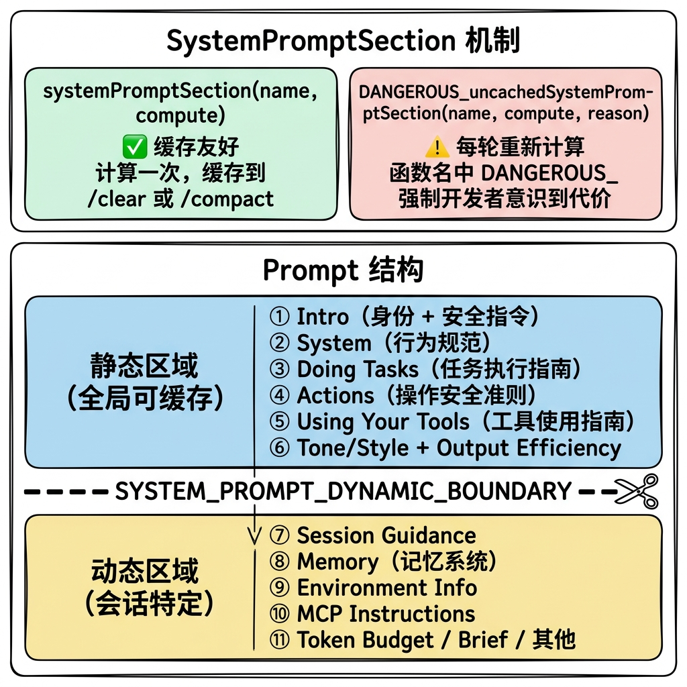

`runAgent()` 是子 agent 的核心执行函数，也是一个 AsyncGenerator。子 agent 复用主 agent 的 query() 函数——同一个 agent loop，只是上下文不同。

清理阶段的 8 项清理操作：MCP 断开、session hooks 清除、prompt cache 清理、文件状态缓存释放、Perfetto 追踪注销、transcript 映射清除、孤儿 todo 清除、后台 bash 终止。

### 5.6 Fork Subagent：Prompt Cache 优化的极致

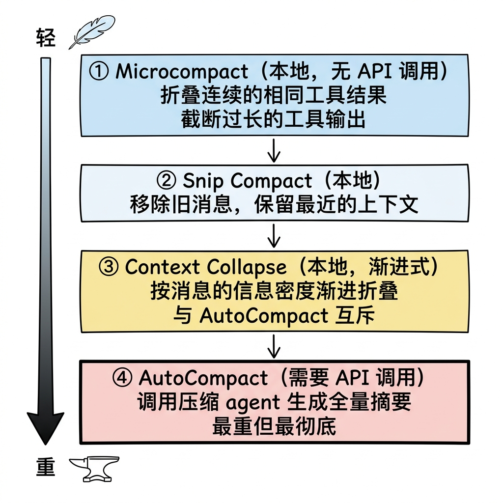

**核心优化目标是最大化 prompt cache 命中率。** 保留父 agent 的完整 assistant message，为每个 tool_use 生成相同的占位 tool_result，只有最后一个文本块因 child 而异。多个 fork 并行启动时共享同一个 prompt cache 前缀。

**防递归设计：** 通过 querySource 检查和消息扫描 `<fork-boilerplate>` 标签来阻止递归 fork。

### 5.8 进程内 Teammate 运行器：最复杂的协作引擎

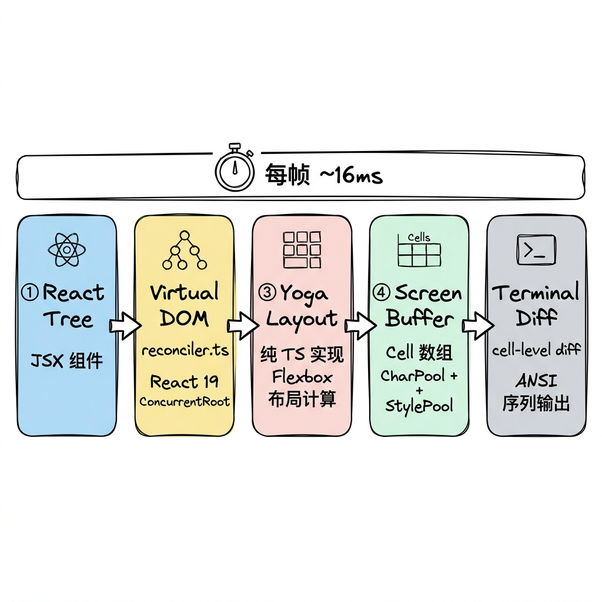

三级降级策略的权限处理：
1. 标准 hasPermissionsToUseTool() 检查
2. 如果结果是 ask，先尝试 classifier 自动审批
3. 通过 leaderPermissionBridge 使用 leader 的 UI 弹出对话框

**内存防护：** `TEAMMATE_MESSAGES_UI_CAP = 50` 限制了消息数量。一个"鲸鱼会话"在 2 分钟内启动了 292 个 agent，达到 36.8GB 内存。

### 5.9 Teammate 通信：邮箱系统与消息路由

Teammate 之间通过文件系统邮箱通信，路径为 `~/.claude/teams/<teamName>/mailbox/<agentName>/`。

### 5.10 Coordinator 模式：纯编排者的设计

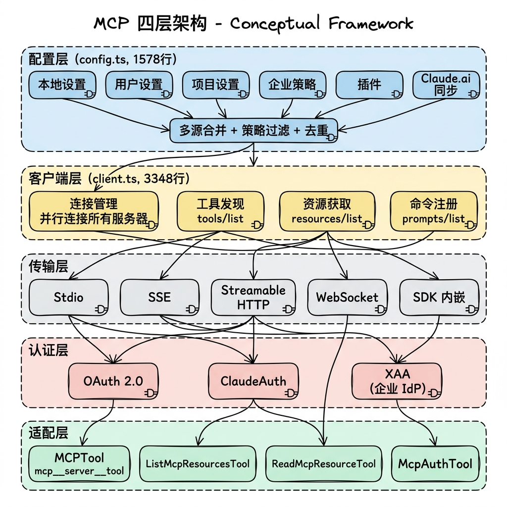

Coordinator 只有自己 ~6 个工具（TeamCreate、TeamDelete、SendMessage、Agent、TaskStop、SyntheticOutput），没有 Bash、Read、Write、Edit。

**最关键的设计原则是"永远不要委派理解"：**

```
Anti-pattern（坏）：Agent({ prompt: "Based on your findings, fix the auth bug" })
Good（好）：Agent({ prompt: "Fix the null pointer in src/auth/validate.ts:42. The user field on Session is undefined when sessions expire..." })
```

### 5.12 权限在多 Agent 场景下的完整传递链

六条规则共同实现了"最小权限 + 不泄漏"的原则。

## 六、System Prompt 工程：Context Engineering 的极致实践

### 6.1 分段缓存架构：Prompt 级别的 Memoization

System prompt 不是一个巨大的字符串，而是一个 `string[]` 数组，每个元素是一个独立的"段落"。

`SYSTEM_PROMPT_DYNAMIC_BOUNDARY` 标记将 prompt 分为两个缓存域：
- 边界之前的静态区域使用 `scope: 'global'` 级别的缓存（跨所有用户共享）
- 边界之后的动态区域不能跨用户缓存

### 6.2 静态区域：agent 的"宪法"

**最小化原则：** 多条规则反复强调"不要过度"——不要添加未被要求的功能、不要为假设的未来需求设计。原文："Three similar lines of code is better than a premature abstraction."

### 6.4 上下文管理：多层压缩策略

AutoCompact 的摘要 prompt 要求保留 9 类信息：
1. 用户请求和意图
2. 关键技术概念
3. 文件和代码片段
4. 错误和修复过程
5. 问题解决过程
6. **所有用户消息**（原文强调"ALL user messages that are not tool results"）
7. 待办任务
8. 当前工作
9. 下一步

特别值得注意的是"所有用户消息"这个要求——这是对 LLM 压缩时容易丢失用户反馈的工程化对策。

## 七、终端 UI：自研 React 终端渲染引擎

### 7.1 渲染管线：五个阶段

1. **React Reconciler：** 使用 react-reconciler 创建自定义 React renderer
2. **纯 TS Yoga 布局：** 原版 Ink 使用 WASM Yoga，Claude Code 用纯 TypeScript 重写
3. **Screen Buffer 的三个对象池：** CharPool、StylePool、HyperlinkPool
4. **Blit 优化：** 如果一个节点的 dirty 标记为 false 且位置/尺寸未变，直接从上一帧复制
5. **DECSTBM 硬件滚动：** 用终端硬件滚动代替重写整个滚动区域

### 7.2 关键优化技术

- **Double Buffering：** 维护 frontFrame 和 backFrame，每帧渲染后交换
- **行缓存：** writeLineToScreen 通过 charCache 缓存每行的解析结果
- **同步更新：** 整个输出包裹在 BSU/ESU 中，确保原子更新

## 八、MCP 集成：标准化的外部工具接入

### 8.2 关键设计决策

- **多源配置合并：** MCP 服务器配置从 6 个来源合并
- **工具适配：** 名称格式 `mcp__<serverName>__<toolName>`
- **动态刷新：** 通过 `refreshTools()` 在 agent loop 的每轮迭代中更新
- **认证流程：** McpAuthTool 让模型可以在对话中触发认证流程

## 九、设计启发与反思

### 9.1 值得学习的设计模式

1. **AsyncGenerator 作为核心抽象：** 整个 agent loop、子 agent 执行、工具执行都基于 AsyncGenerator
2. **Fail-closed 安全默认：** 所有安全相关的默认值都是最保守的
3. **编译时消除 vs 运行时判断：** feature() 宏让同一份代码库同时服务内部和外部用户
4. **Prompt Cache 感知的架构设计：** 整个系统的多个层次都在为 prompt cache 命中率优化
5. **压缩 prompt 的"反遗忘"设计：** 要求保留"所有用户消息"和"直接引用最近对话"

### 9.2 值得商榷的地方

1. **全局状态的广泛使用：** bootstrap/state.ts 包含 200+ 个字段的全局状态对象
2. **权限系统的认知负担：** 8 种来源、5 种模式、3 种匹配模式、多层评估管线
3. **BashTool 的复杂度集中：** 18 个文件、8 层安全检查

### 9.3 如果重新设计

1. **声明式权限策略：** 类似 OPA/Rego 的声明式策略引擎
2. **渐进式上下文管理：** 按消息的"信息密度"渐进式淘汰
3. **工具结果的结构化存储：** 用结构化格式存储，压缩时更精确保留关键信息
4. **模块化构建：** 将工具系统、权限系统、UI 层拆分为独立的包

## 附录：关键文件索引

| 模块 | 核心文件 | 行数 |
|------|---------|------|
| Agent Loop | src/QueryEngine.ts, src/query.ts | 3,024 |
| 工具编排 | StreamingToolExecutor.ts, toolExecution.ts | 2,275 |
| 工具抽象 | src/Tool.ts, src/tools.ts | 1,181 |
| BashTool | src/tools/BashTool/ (18 files) | ~5,000 |
| 权限核心 | src/utils/permissions/permissions.ts | ~1,400 |
| AgentTool | src/tools/AgentTool/ (20 files) | ~6,000 |
| Swarm | src/utils/swarm/ (22 files) | ~5,000 |
| System Prompt | src/constants/prompts.ts | 914 |
| 压缩 | src/services/compact/ (11 files) | 3,960 |
| Ink 渲染引擎 | src/ink/ (90 files) | 19,842 |
| MCP 客户端 | src/services/mcp/client.ts | 3,348 |
