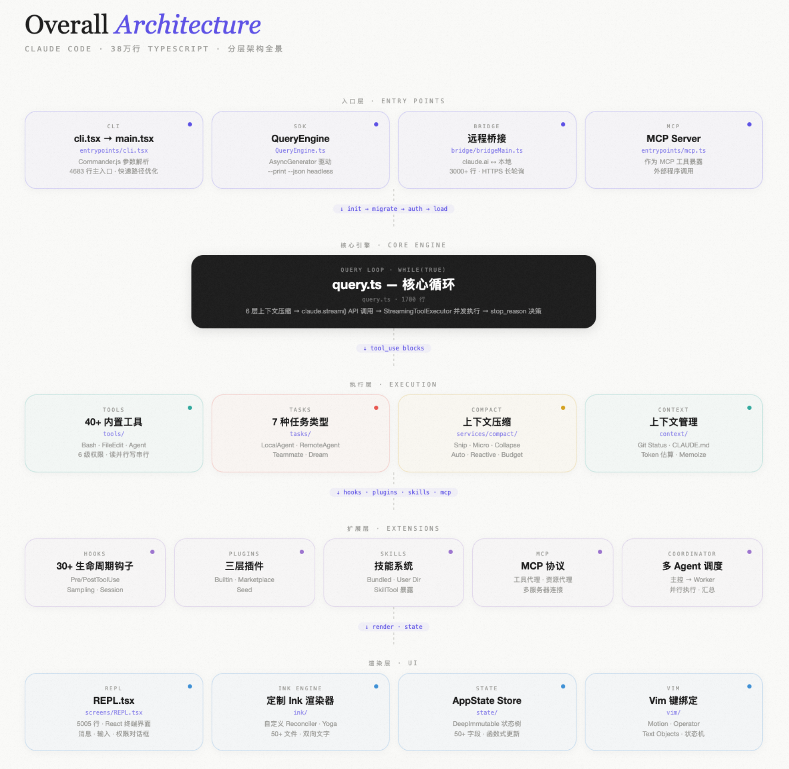
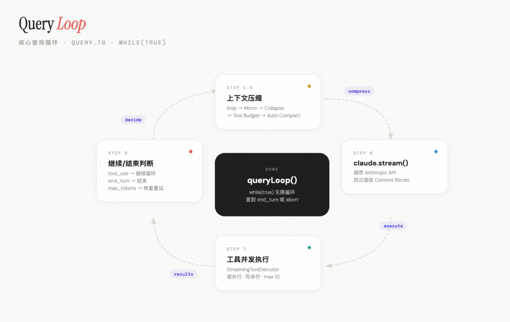
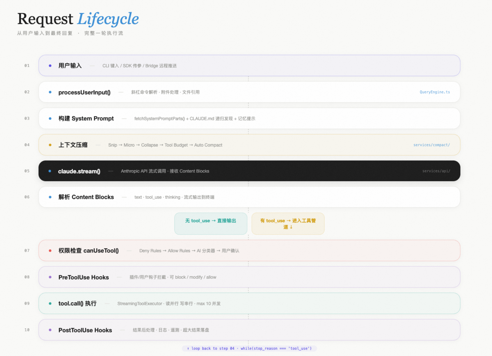
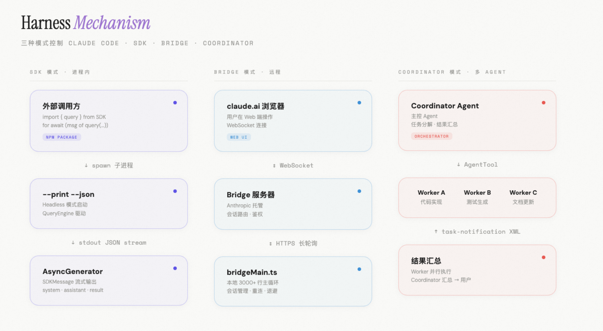
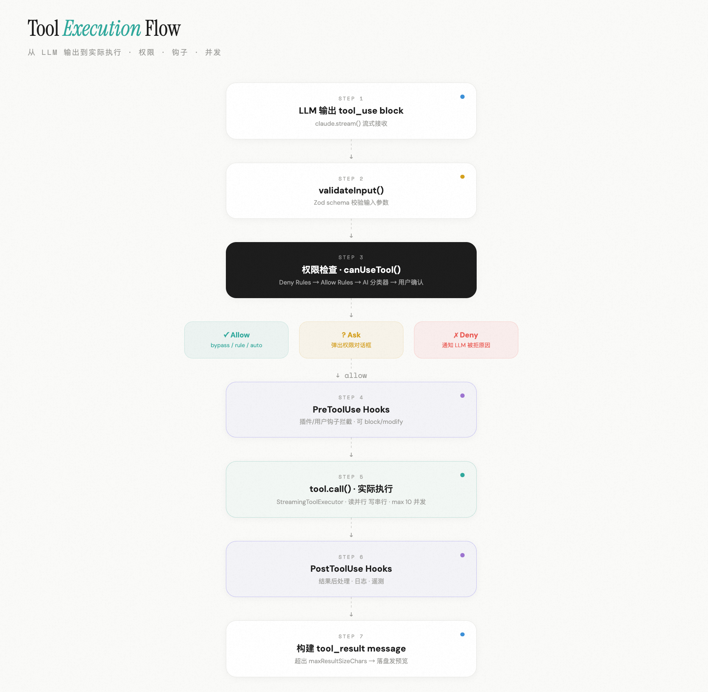
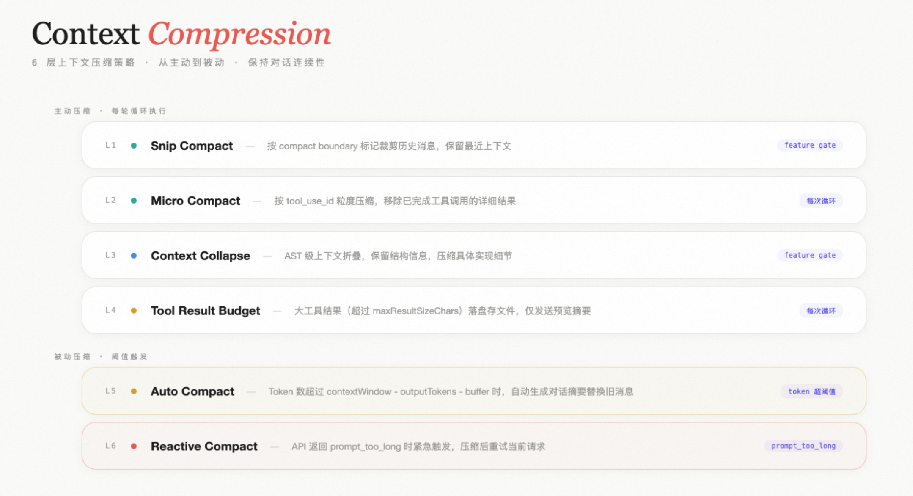

# 【Claude Code 源码分析】万行代码背后的 AI Harness 编码操作系统



> **作者：** 孙翔宇(柏锦) | **中国电商事业群-淘天集团**
> **发布时间：** 2026年3月31日 | **浏览：** 4.0k | **点赞：** 115
> **代码规模：** 约 38 万行 TypeScript/TSX

---

## 一、整体架构

### 1.1 目录结构与模块划分

```
claude-code/
├── main.tsx                 # 主入口（CLI 参数解析、初始化、启动 REPL）
├── QueryEngine.ts           # 对话引擎（SDK/headless 路径）
├── query.ts                 # 核心查询循环（API 调用 → 工具执行 → 循环）
├── Tool.ts                  # 工具类型定义与接口
├── Task.ts                  # 任务类型定义
├── tools.ts                 # 工具注册表（内置工具列表）
├── commands.ts              # 斜杠命令注册表
├── context.ts               # 上下文构建（git status、CLAUDE.md）
├── ink.ts                   # Ink 渲染层封装
├── replLauncher.tsx         # REPL 启动器
│
├── entrypoints/             # 入口点
├── screens/                 # 界面屏幕
├── state/                   # 状态管理
├── tools/                   # 工具实现（每个工具一个目录）
```

### 1.2 核心入口流程



```
cli.tsx (entrypoint)
  ↓ 快速路径检查 (--version, --dump-system-prompt, --daemon-worker)
  ↓
main.tsx (main 函数, 4683 行)
  ├── 1. Side-effect imports（profileCheckpoint, MDM prefetch, keychain prefetch）
  ├── 2. Commander.js 解析 CLI 参数
  ├── 3. init() — 启用配置、环境变量、TLS、GracefulShutdown
  ├── 4. runMigrations() — 配置迁移（v1→v11）
  ├── 5. Trust Dialog — 首次使用信任确认
  ├── 6. 认证检查 — API Key / OAuth
  ├── 7. 加载 MCP 服务器、Skills、Plugins
  ├── 8. 构建 AppState 初始状态
  ├── 9. 分支：
  │   ├── --print（headless 模式）→ QueryEngine → 直接输出
  │   └── 交互模式 → launchRepl() → REPL.tsx
  └── 10. startDeferredPrefetches() — 延迟预取（git status、用户信息等）
```

**关键设计：启动时间优化**
- profileCheckpoint 在各阶段打点，追踪启动性能
- MDM 读取和 Keychain 读取并行化（macOS）
- startDeferredPrefetches() 将非关键预取推迟到首次渲染之后
- --bare 模式跳过所有预取，极限精简
- feature() 编译时死代码消除（DCE），外部构建移除内部功能

### 1.3 状态管理方式



Claude Code 使用 **不可变状态树 + 函数式更新** 模式：

```typescript
// AppState 是一个巨大的 DeepImmutable<> 类型
export type AppState = DeepImmutable<{
  settings: SettingsJson
  mainLoopModel: ModelSetting
  toolPermissionContext: ToolPermissionContext
  tasks: Record<string, TaskState>
  mcp: { tools: Tools; clients: MCPServerConnection[] }
  fastMode: FastModeState
  speculation: SpeculationState
  // ... 50+ 字段
}>

// 更新通过 setAppState(fn) 函数式传递
setAppState(prev => ({
  ...prev,
  toolPermissionContext: { ...prev.toolPermissionContext, mode: 'bypassPermissions' }
}))
```

Store 实现 (state/store.ts)：自研的简单 Store，类似 zustand 但更轻量。无 Redux/MobX 依赖。

### 1.4 渲染层 — Ink/React CLI



Claude Code 深度定制了 Ink 框架（React CLI 渲染器），在 ink/ 目录下维护了自己的分支：
- reconciler.ts — 自定义 React Reconciler
- layout/ — 基于 Yoga 的终端布局引擎
- termio/ — 低级终端 I/O（DEC escape codes、光标控制）
- renderer.ts — 帧渲染器
- screens/REPL.tsx（5005 行）是最核心的 UI 文件

## 二、核心引擎



### 2.1 QueryEngine — 对话引擎

QueryEngine.ts（~1300 行）是 SDK/headless 路径的核心：

```typescript
submitMessage(prompt)
  ├── 1. processUserInput() — 解析斜杠命令、附件
  ├── 2. 构建 SystemPrompt
  │   ├── fetchSystemPromptParts() — 默认系统提示
  │   ├── loadMemoryPrompt() — 记忆提示
  │   └── appendSystemPrompt — 追加提示
  ├── 3. recordTranscript() — 持久化用户消息
  ├── 4. yield buildSystemInitMessage() — SDK 系统初始化消息
  ├── 5. query() — 进入核心查询循环
  └── 6. yield result — 最终结果
```

**关键设计：**
- **AsyncGenerator 模式**——每个消息通过 yield 逐步发出，允许 SDK 消费者实时处理
- 消息在产生时立即持久化（recordTranscript），即使进程被 kill 也能 --resume
- 权限拒绝单独追踪，最终在 result 消息中报告

### 2.2 query.ts — 核心查询循环



```
query()
  └── queryLoop()  // while(true) 循环
        ├── 1. snipCompactIfNeeded()     — Snip 压缩
        ├── 2. microcompact()            — 微压缩
        ├── 3. applyCollapsesIfNeeded()  — 上下文折叠
        ├── 4. applyToolResultBudget()   — 工具结果预算
        ├── 5. autocompact()             — 自动压缩
        ├── 6. claude.stream()           — 调 Anthropic API
        │   ├── 流式接收 content blocks
        │   ├── StreamingToolExecutor 并发执行工具
        │   └── 收集所有工具结果
        ├── 7. stopHooks / postSamplingHooks — 停止钩子
        ├── 8. 判断是否继续循环
        └── 9. 更新 state，continue
```

**多层上下文压缩策略：**

| 层级 | 名称 | 触发条件 | 策略 |
|------|------|---------|------|
| L1 | Snip Compact | feature gate | 按 boundary 裁剪历史 |
| L2 | Micro Compact | 每次循环 | 微粒度压缩（按 tool_use_id） |
| L3 | Context Collapse | feature gate | AST 级上下文折叠 |
| L4 | Auto Compact | token 超阈值 | 对话摘要压缩 |
| L5 | Reactive Compact | prompt_too_long | 紧急压缩重试 |
| L6 | Tool Result Budget | 每次循环 | 大结果落盘，发送预览 |

### 2.4 Tool.ts / tools/ — 工具系统


```typescript
export type Tool<Input, Output, P> = {
  name: string
  aliases?: string[]
  searchHint?: string
  inputSchema: Input
  maxResultSizeChars: number

  // 核心方法
  call(args, context, canUseTool, parentMessage, onProgress?): Promise<ToolResult<Output>>
  description(input, options): Promise<string>
  checkPermissions(input, context): Promise<PermissionResult>
  validateInput?(input, context): Promise<ValidationResult>

  // 行为标记
  isEnabled(): boolean
  isReadOnly(input): boolean
  isDestructive?(input): boolean
  isConcurrencySafe(input): boolean
  interruptBehavior?(): 'cancel' | 'block'
  isSearchOrReadCommand?(input): { isSearch; isRead; isList? }
  // ...
}
```

### 2.5 上下文管理（context/）

```typescript
// 系统上下文：git status（分支、状态、最近提交）
getSystemContext() → { gitStatus, cacheBreaker? }

// 用户上下文：CLAUDE.md 文件内容、当前日期
getUserContext() → { claudeMd, currentDate }
```

- 两个函数都用 memoize 缓存，会话内只计算一次
- CLAUDE.md 通过 getClaudeMds() 从工作目录递归发现
- --bare 模式跳过自动发现，但保留 --add-dir 显式指定

## 三、Harness 机制

### 3.1 什么是 Harness

Harness 由两个核心入口 + 三个扩展点组成：

**核心入口（控制 Claude Code）：**
- **SDK 模式：** 进程内 API，@anthropic-ai/claude-code-sdk npm 包
- **Bridge 模式：** 远程控制协议，claude.ai 通过长轮询接入本地 Claude Code 实例

**扩展点（Harness 对外暴露的插入位置）：**
- **Hooks：** 30+ 生命周期钩子（PreToolUse、PostToolUse 等）
- **Plugins：** 提供 Skills、Hooks、MCP Servers、自定义命令
- **Coordinator 模式：** 主 Agent 通过 Harness 的 SDK 模式调度 Worker Agent

### 3.3 Hooks 系统 — 生命周期钩子

utils/hooks.ts 定义了 30+ 生命周期钩子：

```
会话级钩子：
  executeSetupHooks()              — 设置阶段
  executeSessionStartHooks()       — 会话开始
  executeSessionEndHooks()         — 会话结束

工具级钩子（最核心）：
  executePreToolHooks()            — 工具执行前
  executePostToolHooks()           — 工具执行后
  executePostToolUseFailureHooks() — 工具执行失败后
  executePermissionDeniedHooks()   — 权限被拒后

压缩钩子、采样钩子、Swarm 钩子、其他...
```

Hooks 可以通过多种来源注册：
- `.claude/settings.json` 中的 hooks 配置
- Plugin 的 hooksConfig 定义
- Agent 定义文件中的 frontmatter hooks

### 3.4 Plugins 系统

**插件类型：**
1. **Built-in Plugins** — 随 CLI 发布，可开关
2. **Marketplace Plugins** — 从 Anthropic 插件市场安装
3. **Seed Dir Plugins** — 通过环境变量指定

**插件能力：**
- 提供 Skills（斜杠命令 + 工具技能）
- 提供 Hooks（生命周期钩子）
- 提供 MCP Servers
- 自定义命令

### 3.6 coordinator/ 目录的作用

```
Coordinator 模式四阶段工作流：
1. Research（研究）：并行派多个 Worker 调研代码库
2. Synthesis（综合）：协调者阅读所有研究结果
3. Implementation（实施）：派 Worker 按具体 spec 修改代码
4. Verification（验证）：独立 Worker 验证修改
```

与 Swarm 模式的区别：
- **Coordinator 模式：** 主 Agent 调度 Worker，Worker 是无状态的一次性 Agent
- **Swarm 模式：** 平等的 Teammate 协作，有持久状态

## 四、工具系统深度分析

### 4.1 内置工具列表和分类

| 分类 | 工具 | 说明 |
|------|------|------|
| 文件操作 | BashTool | Shell 命令执行（核心） |
| | FileReadTool | 文件读取 |
| | FileEditTool | 文件编辑（精确替换） |
| | FileWriteTool | 文件写入 |
| | GlobTool | 文件模式匹配 |
| | GrepTool | 文本搜索 |
| 任务管理 | AgentTool | 子 Agent 调度 |
| | TaskCreate/Get/Update/ListTool | 任务 CRUD |
| Web | WebFetchTool/WebSearchTool | 网页抓取/搜索 |
| 协作 | TeamCreateTool/TeamDeleteTool | 团队管理 |
| MCP | MCPTool | MCP 工具代理 |
| 特殊 | SleepTool, ScheduleCronTool 等 | 休眠/定时任务 |

### 4.2 工具调用流程

```
LLM 输出 tool_use block
  ↓
StreamingToolExecutor.addTool(block, assistantMessage)
  ├── 查找工具定义：findToolByName(tools, block.name)
  ├── 判断并发安全性：tool.isConcurrencySafe(input)
  ├── 并发安全 → 加入并发队列
  └── 非并发安全 → 等待独占执行
  ↓
runToolUse(block, assistantMessage, canUseTool, context)
  ├── 1. tool.validateInput(input, context) — 输入验证
  ├── 2. canUseTool(tool, input, ...) — 权限检查
  ├── 3. PreToolUse hooks — 工具前钩子
  ├── 4. tool.call(input, context, ...) — 实际执行
  ├── 5. PostToolUse hooks — 工具后钩子
  └── 6. 返回 ToolResult → 构建 tool_result message
```

**StreamingToolExecutor 的并发模型：**
- 并发安全工具（如 FileRead、Grep）：并行执行
- 非并发安全工具（如 BashTool、FileEdit）：串行执行
- 最大并发度：`CLAUDE_CODE_MAX_TOOL_USE_CONCURRENCY`（默认 10）

### 4.3 权限模型

**Permission Modes：**

| 模式 | 说明 |
|------|------|
| default | 默认——危险操作需要用户确认 |
| plan | 计划模式——只读操作允许，写操作阻塞 |
| acceptEdits | 自动接受文件编辑 |
| bypassPermissions | 绕过所有权限检查 |
| dontAsk | 不询问直接拒绝 |
| auto | 自动模式——AI 分类器决策 |
| bubble | 冒泡给父级（内部） |

## 五、为什么做得好

### 5.1 架构亮点

1. **AsyncGenerator 驱动的流式架构** — 从 API 调用到 SDK 输出，整个链路使用 AsyncGenerator 串联
2. **编译时死代码消除（DCE）** — 通过 feature() 门控，Bun 在打包时自动消除未启用功能的代码
3. **多层上下文压缩** — 6 层压缩策略，每一层解决不同场景
4. **工具并发执行** — 读操作并行、写操作串行
5. **状态持久化与恢复** — 每条消息立即写入 transcript，--resume 可以从任意断点恢复

### 5.3 安全模型设计

1. **多维度权限控制** — 企业策略 → 用户设置 → 项目设置 → CLI 参数 → 工具自检 → AI 分类器 → 用户确认
2. **沙箱隔离** — SandboxManager 支持在沙箱环境中执行 Bash 命令
3. **Bash 安全分析** — bashSecurity.ts + bashPermissions.ts 对每条 bash 命令进行 AST 解析
4. **文件路径验证** — filesystem.ts 实现了严格的路径验证

### 5.4 性能优化策略

| 优化 | 实现 |
|------|------|
| 启动预热 | MDM/Keychain 并行、Git status 预取 |
| 工具并发 | StreamingToolExecutor 读操作并行 |
| 上下文压缩 | 6 层策略按需触发 |
| 缓存 | FileStateCache LRU、prompt cache 稳定性 |
| 死代码消除 | feature() 编译时消除 |
| 懒加载 | 大模块动态 import()/require() |

### 5.5 与竞品差异化

| 维度 | Claude Code | Codex (OpenAI) | Aider |
|------|-------------|----------------|-------|
| 架构 | 完整 React CLI 应用 | 相对精简的 CLI | Python 脚本 |
| 渲染 | 自定义 Ink（丰富 UI） | 简单终端输出 | 文本输出 |
| 多 Agent | Coordinator + Swarm 模式 | 单 Agent | 单 Agent |
| 权限 | 6 种模式 + AI 分类器 | 沙箱隔离 | 无 |
| 上下文管理 | 6 层压缩策略 | 基础 | git diff 为中心 |
| 远程控制 | Bridge + SDK + REPL Bridge | API 模式 | 无 |

## 六、对我们的启发

### 6.1 值得借鉴的设计

1. **AsyncGenerator 流式架构** — 天然支持流式输出、背压控制、取消传播、可组合性
2. **多层上下文压缩** — 至少实现 Auto Compact + Tool Result Budget 两层
3. **工具权限模型** — 渐进式权限 + AI 分类器是优秀的 UX 设计
4. **Hook 系统** — 30+ 生命周期钩子覆盖了几乎所有扩展点
5. **启动性能工程** — profileCheckpoint 遍布代码各处，启动时间被当作 P0 优化

### 6.2 可以直接复用的部分

1. **Bash 安全分析** — AST 解析、命令语义分析、安全检查逻辑
2. **文件操作工具** — FileEditTool（精确替换）、FileReadTool（带行号和大小限制）
3. **MCP 集成** — MCP 客户端实现、配置管理、工具代理逻辑
4. **Token 估算和上下文窗口管理** — token 计算和上下文窗口管理逻辑
5. **Git 操作工具** — Git 状态获取、分支管理等工具函数

## 七、深度补充：CodeWiki 精华提炼

### 7.1 QueryEngine 三层重试机制

**第一层：模型回退重试**
- 触发：FallbackTriggeredError（首选模型高负载）
- 行为：清除当前消息，自动切换备用模型，生成系统警告通知用户

**第二层：输出 Token 限制重试**
- 触发：stop_reason === "max_tokens"
- 第一阶段：如果启用 token slot 功能，尝试 64k token 限制重试
- 第二阶段：最多 3 次恢复重试，每次注入恢复提示
- 恢复提示原文："Output token limit hit. Resume directly — no apology, no recap of what you were doing."

**第三层：上下文超长重试**
- 触发："prompt too long" 错误
- 流程：先试 context collapse 排水 → 失败则 reactive compact → 都失败才报错

### 7.2 Agent 多智能体协调（重点）

**模式一：同步子 Agent** — 最简单的委托，等结果返回

**模式二：异步后台 Agent** — 注册后立即返回，结果写入磁盘文件

**模式三：Coordinator 模式** — 四阶段流水线（Research → Synthesis → Implementation → Verification）

**模式四：Team 模式（Swarm）** — 通过文件系统邮箱通信，队友空闲后自动进入等待态

Agent 内存三作用域：

| 作用域 | 路径 | 特点 |
|--------|------|------|
| user | ~/.claude/agent-memory/<type>/ | 跨项目共享 |
| project | <cwd>/.claude/agent-memory/<type>/ | 可版本控制 |
| local | <cwd>/.claude/agent-memory-local/<type>/ | 不提交 git |

### 7.3 上下文压缩策略（完整版）

**策略一：Auto Compact（主力）**
- 触发条件：token 超过 contextWindow - outputTokens - 13000
- 摘要结构化为 9 个维度
- 断路器：连续失败 3 次自动停止

**策略二至五：** Micro Compact（缓存编辑型）、Micro Compact（时间型）、Session Memory Compact（实验性）、Partial Compact（用户手动）

### 7.6 API 错误分类体系

| 错误类型 | HTTP 状态码 | 重试策略 |
|---------|------------|---------|
| rate_limit | 429, 529 | 可重试 |
| authentication_failed | 401, 403 | 不可重试 |
| server_error | >= 408 | 可重试 |
| unknown | 其他 | 不可重试 |

## 附录：核心文件代码量

| 文件 | 行数 | 说明 |
|------|------|------|
| screens/REPL.tsx | 5005 | 最大的 UI 文件 |
| main.tsx | 4683 | 主入口（CLI 解析 + 初始化） |
| bridge/bridgeMain.ts | 3000+ | Bridge 主循环 |
| query.ts | 1700+ | 核心查询循环 |
| utils/permissions/permissions.ts | 1500+ | 权限逻辑 |
| services/compact/compact.ts | 1705 | 压缩逻辑 |
| QueryEngine.ts | 1300+ | 对话引擎 |
| tools/BashTool/BashTool.tsx | 1100+ | Bash 工具 |
| Tool.ts | 800+ | 工具类型定义 |
