# Aone Copilot 工程实践：Context Engineering 进化史

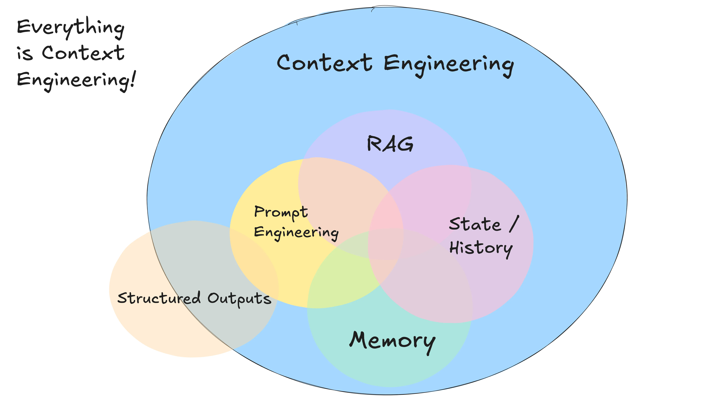

> **作者：** 李芮(上宣) | **阿里控股**
> **发布时间：** 2026年4月3日 | **更新：** 2026年4月3日
> **浏览：** 1.0k | **点赞：** 114

---

## 前言

此时正值 Aone Copilot Agent 发布一周年，在过去的一年中，模型的能力在不断进步，设计的范式在不断创新，Aone Copilot 的今天，建立于业界的进步，团队的努力，用户的支持。

Coding Agent 是一个高度内卷的方向，一年来，我们团队的成员都在不断探索、并尝试将一些业界比较前沿的设计和想法落地到产品之中。由于模型能力和设计范式一直在变化，Context Engineering 方案也随之不断被推翻、不断演进，其间诞生的许多方案都有时代局限性，是非功过难以论述。因此，除了一些小型的内部分享外，我们一直没有对外披露过多细节。

ATA 上已有很多探讨上下文设计与方案选型的文章，但大多以陈列观点和结论为主，较少讨论：这些设计的背景是什么？是如何出现的？一些设计在当下看来并不合理但当时为什么会这么做？这些设计解决了某些问题的同时又有哪些局限性？在当前 Aone Copilot Agent 发布一周年的节点上，我愿和各位以 Aone Copilot Agent 的 Context Engineering 的演进为线索，一同回忆与思考。

## 我们对 Context Engineering 的理解

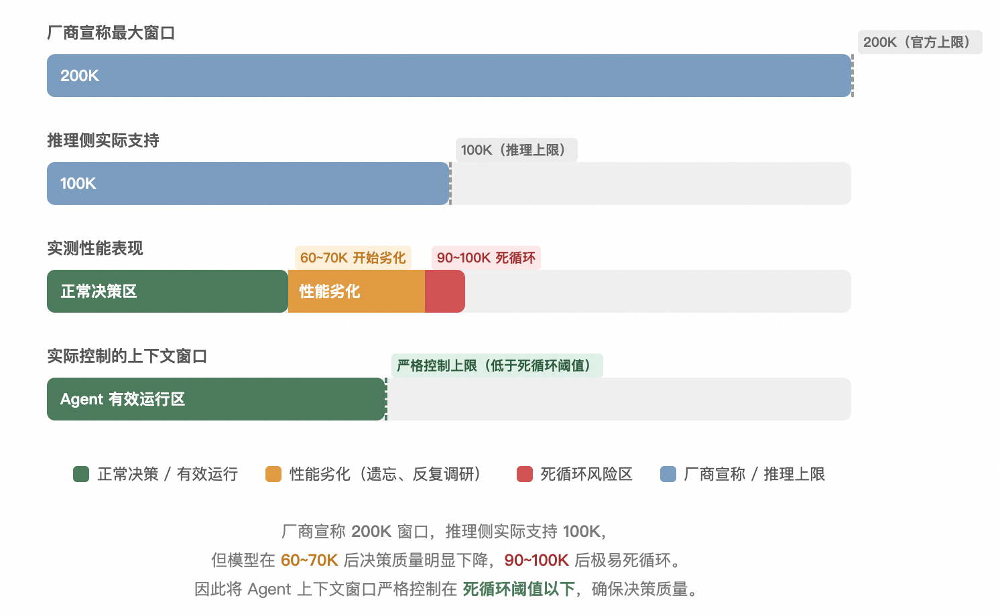

和两年前我写过的 ATA 观点一样，我仍然认为对于 LLM 应用来说，模型决定了自动化的上限，而工程只是推动场景落地，对于 Agent 这种强依赖模型能力的场景来说，更是如此。对于一款 Agent 产品，除了模型本身要足够强，还需要解决三个问题：

1. **如何让 Agent 更好地感知环境**
2. **如何高效地组织上下文信息**
3. **如何让 Agent 的行为更可控好用**

这三者是场景落地的关键，也是应用侧工程的主要着力点。围绕这些问题衍生出的一系列上下文相关的工程设计，我们统称为 **Context Engineering**。

## 早期模型能力的困境与应对

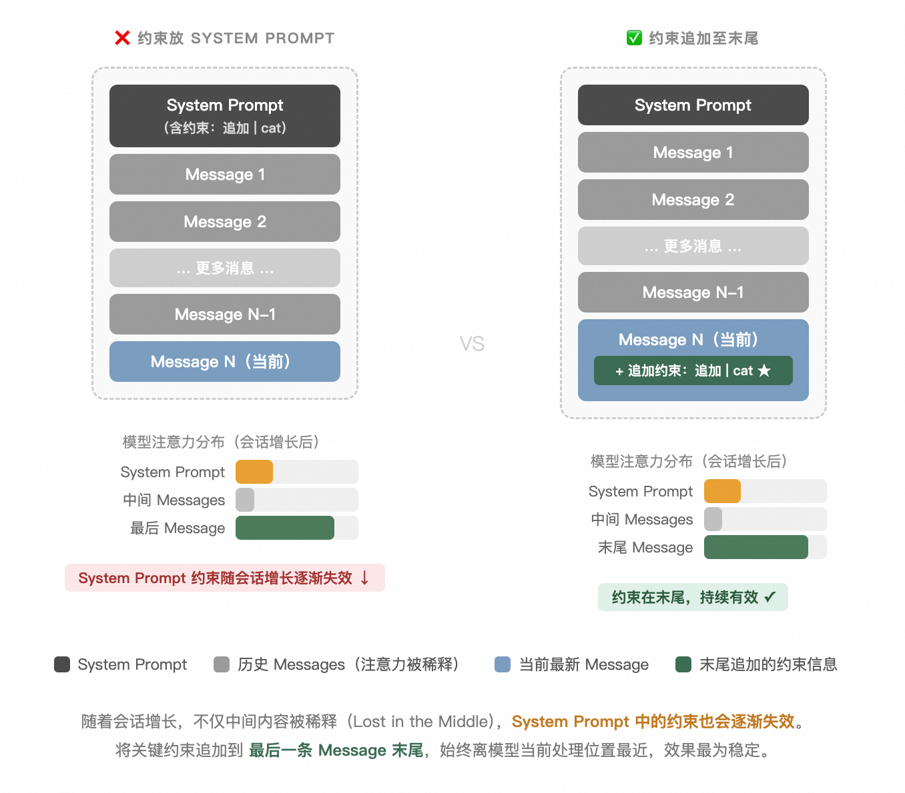

Aone Copilot Agent 诞生节点是去年的三月中旬，彼时最好的模型 Claude 3.5 Sonnet、Deepseek V3、Qwen 2.5 Max，也正是 Manus 如日中天的时候。也正如肖宏所说，团队在尝试遍所有主流模型后，发现只有 Claude 3.5 Sonnet 能比较稳定地跑起 Agent，不同的旗舰型模型在进行几轮迭代后，普遍不同程度地存在以下问题（包括 Claude）：

- **针对反馈信息产生决策的能力弱** — 经常过早地实施行动、结束任务，或者当出现异常情况时经常没办法及时得出有效的方案，容易不断地尝试从而陷入死循环
- **指令跟随能力极差** — 许多写在开头 System Prompt 里的约束内容在 Agent 运行几轮过后几乎不生效
- **能支持的上下文窗口比较小** — 以彼时我们能在内部稳定使用的 Deepseek V3 模型服务为例，能支持的最大输入只有 100K 不到
- **上下文腐化的问题非常严重** — 尽管当前的 Token 用量远低于模型的理论窗口，但仍然很容易出现遗忘和重复的情况。且当 Token 用量到了某个数值后，模型的决策质量会下降的非常厉害，让本就不多的上下文窗口雪上加霜。

由于上述问题的存在，简单地按 `System Prompt + User Input + LLM Response + Tool Result` 逐条追加的方式构建上下文，几乎无法让 Agent 正常运行。当时 Aone Copilot Agent 刚上线，用户量不多，预算较为充裕，Prompt Cache 也尚未普及，因此我们在不考虑成本和 Cache 的前提下，采取了以下手段来针对性地解决这些问题。

### 严格限制 Agent 的上下文窗口

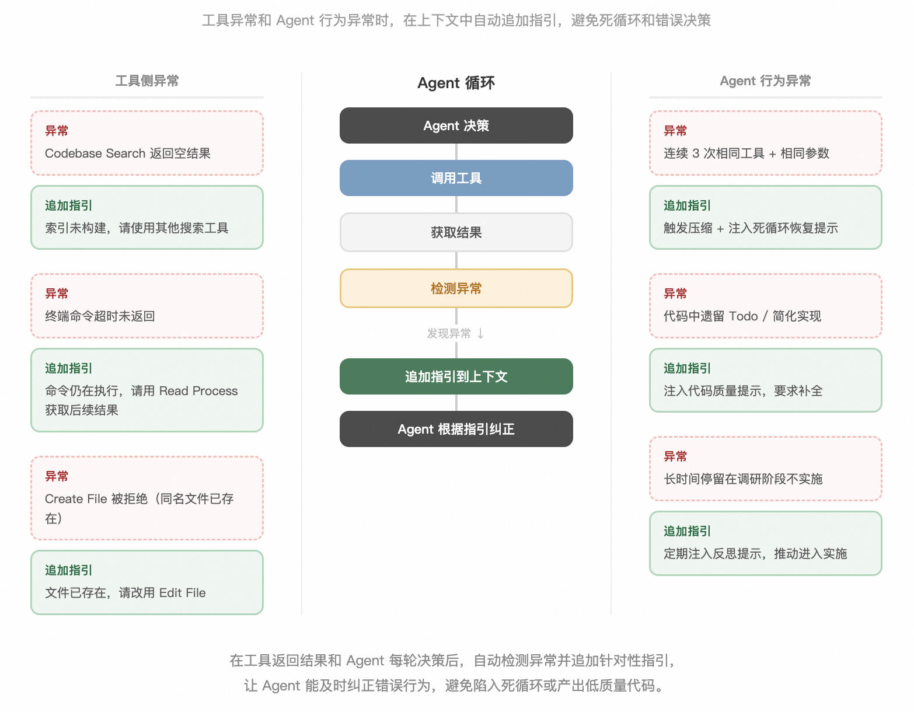

以某国产模型为例，我们推理侧能支撑 100K 输入，官方声称支持 200K，但实际使用中，Token 用量到 **60 ~ 70K** 后决策质量就会明显下降——在代码任务里表现为反复调研、迟迟不进入实施阶段；到 **90~100K** 时则极易进入死循环。因此我们通过样例实验，大致摸清了线上模型的降智和死循环这两个阈值，并把上下文窗口严格控制在比死循环阈值更小。

这也是为什么模型厂商声称支持很大的上下文窗口，而应用侧许多产品实际不会用满的原因。

### 利用尾部注意力放置关键约束

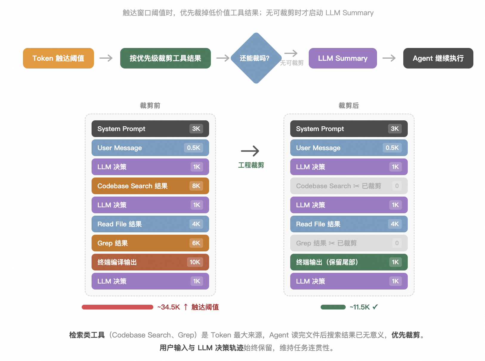

Transformer 的注意力机制在处理长序列时，并不会对所有位置的 Token 一视同仁。研究表明中间部分的内容最容易被稀释（即 **"Lost in the Middle"** 现象），而在 Agent 这种会话轮次多、上下文持续增长的场景中，我们发现不仅中间内容容易被忽略，开头 System Prompt 中的约束也会随着会话的增长而逐渐失效——初始几轮还算有效，但越往后跟随效果越差。相比之下，**放在尾部（最近几条 Message）的内容始终离模型当前处理的位置最近，效果最为稳定。**

基于这个原理，在我们实际的尝试过程中，我们发现一些要求 Agent 必须遵守的约束类的信息相比直接放到 System Prompt 里，**直接追加到最后 Message 里会更有效**。以一个 Agent 使用终端工具的场景为例：Agent 在使用 Git 类操作时很容易遇到翻页器导致的命令执行一直结束不了的情况，早期我们的处理方式是要求模型在执行这种交互式命令的时候，能够在后面追加 `| cat`，这个约束放在 System Prompt 中，但是经常不遵循。在经过多次尝试后，最终发现只有将约束追加到最后才会在 Agent 执行过程中持续生效。

基于此发现，在后续迭代的过程中，当我们有其他需要让 Agent 持续关注始终遵守的信息时，都会在最后的 Message 中追加这些信息。

### 异常场景下的额外指引

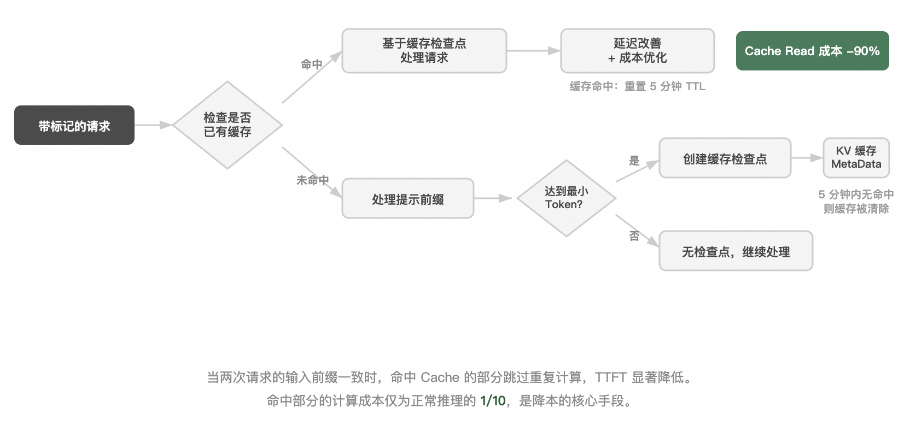

由于工具实现上的限制，往往在使用的过程中，会出现非预期的情况，如：

- Codebase Search 索引没有构建好时，会搜不到结果
- 当本地存在一份同名文件时，Create File 工具会自动拒绝掉相应的操作
- 终端工具运行的实际时间可能超出了我们设定的时间

遇到此类异常情况，如果不加以引导，Agent 容易进入死循环不断重试，或者选择了预期之外的方式来处理问题，时而成功时而失败，非常影响使用体验。对于此类工具侧容易产生的问题，我们会在工具的执行结果出现异常时，在结果后追加额外的提示语，如：

- 当 Codebase Search 没搜到结果说明索引没有构建好，可以使用别的搜索工具进行检索
- 当前的终端命令还没执行完，请使用 Read Process 工具进行等待并获取后续的结果等

除了工具侧，Agent 本身也可能出现非预期的情况，如在代码中遗留 Todo 或简化实现、重复多次执行同样的工具用同样的参数、反复进行调研迟迟不进入实施阶段、Todo 中的某一事项没有完成已经将状态标志为完成等。我们通过算法、工程的手段，识别到模型的输出中出现了类似问题时，也会在 Message 的末尾，追加相应的提示语，提醒模型及时纠正此类问题。

### 工程裁剪控制上下文膨胀

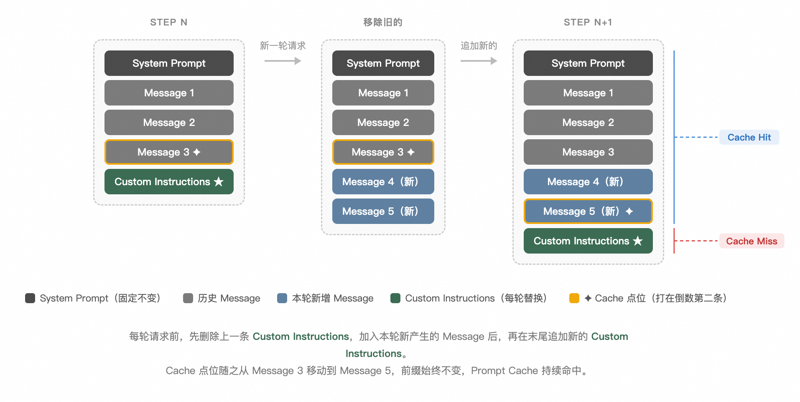

这一点也是具有时代特色和争议的一点。在当时，当 Token 用量到达 Agent 窗口阈值时，大家处理的方案主要有三种：

1. **从头开始丢弃信息** — 在 Agent 场景中明显不可用
2. **直接用大模型进行 Summary，然后替换掉全量的 Message** — 因当时能使用的模型普遍能支持的有效窗口较小，很容易触发频繁的压缩，体感很差
3. **使用工程裁剪的方式，裁剪掉不重要的信息** — 最终选择

当时和字节的同学讨论过后，最后选的方式是**工程裁剪 + Summary 相结合**。

具体来说，分析线上 Case 后我们发现：

- 大部分 Token 消耗来自检索阶段的搜索工具，而 Agent 搜到关键片段后往往还会去读文件做二次确认，此时搜索结果已无保留价值
- 编译日志、单测输出等终端工具的超长输出大多是一次性的，早期的信息价值极低

于是针对这个规律，我们给不同的工具分配不同的优先级，当 Token 用量到达指定窗口时，优先裁剪掉优先级低的工具结果，当没有东西可以裁剪的时候，才会进行 Summary。同时在执行的过程中，因为我们会不断往 Message 中加入额外的提示信息，会有许多重复的提示信息，因此在每次请求模型之前，都会用工程的手段清理掉重复、无效的部分。

这个方案对当时能力较弱的模型更为友好。Summary 无论采用何种策略都会丢失信息，强模型尚能从摘要中的蛛丝马迹重新定位所需内容，弱模型则极易因信息丢失导致执行质量骤降。而裁剪方案保留了 Agent 的完整执行轨迹，还原所需信息的难度更低。

但该方案最大的争议点在于**裁剪方案会破坏 Prompt Cache**。有一次我们和某团队的同学分享方案时，他们诧异于我们居然不考虑 Prompt Cache 的问题，我给的答复是当前的预算消耗较为可控，暂时不考虑成本问题。但是这确实埋下了相当大的隐患，以至于这个套方案在后面被我们所放弃，用了又一个半年的时间来构建、完善新的方案。

上述提到的方案大致在线上平稳运行了半年左右，尽管有在一些策略有所调整，但大体上是一脉相承的。在这段时间 Aone Copilot Agent 的用户数一路从最初的 300 人增长至 3000 人，当人数越来越多，使用 Agent 越来越熟练，任务数越来越多，步骤也越来越长时，不断增长的预算终于让我们走到了一个新的转折点。

## 成本优先的抉择

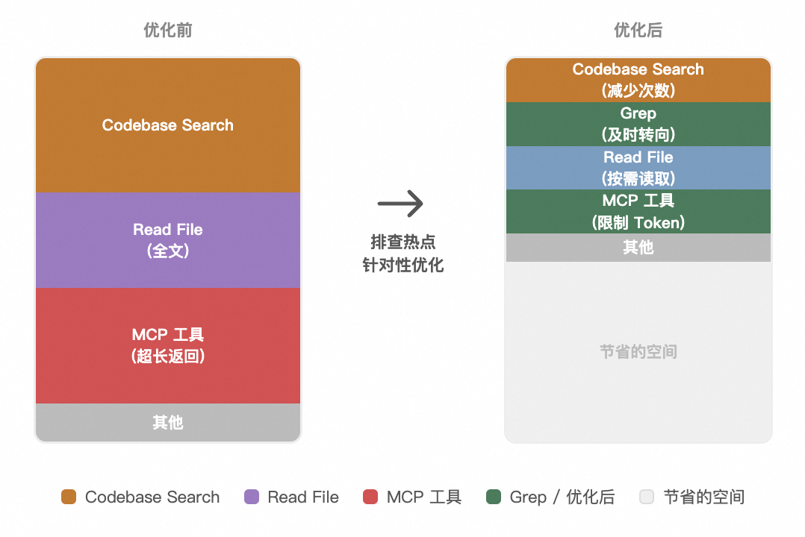

由于成本的不断增长，降本迫在眉睫，当时我们在线上排查到了部分因为模型停不下来，导致任务一直在运行的 Case，基于此我们对一些超长的任务做了拦截，但依然杯水车薪。当时很巧的是 AWS 那边有销售来 C 区做分享，其中正好地分享了关于 Prompt Cache 部分的内容，里面提到的重点内容大致有两个：

1. 如果两次请求的输入前缀一致，之前存下的 Cache 能够避免模型在推理的时候对重复的部分进行重复计算，能够优化 TTFT
2. **前缀里命中 Cache 的部分，成本只有原来的 1/10**

第二点可以说解决了我们的燃眉之急，于是我们从 9 月份开始，就着手对原有的 Context Engineering 方案进行针对性的改造。主要的思路是在尽可能不修改前文破坏 Prompt Cache 的情况下，减缓上下文膨胀的速度，同时能够保留之前一些试验过的成功经验。

> 任何破坏前缀的行为都会破坏 Prompt Cache，进而带来成本的增加。因此在后续迭代中，我们全量移除了修改已有 Message 内容的逻辑，Token 用量达到窗口上限时的处理方式也从工程裁剪改为模型 Summary。

这一转变同样得益于内部模型开始支持更大的窗口，长 Token 时的性能劣化不再那么明显。但由于不能及时移除历史工具的结果和注入的额外提示，Token 膨胀速度开始猛增，Summary 的频次也随之变高，因此我们针对性地做了以下优化。

### 优化额外提示的注入方式

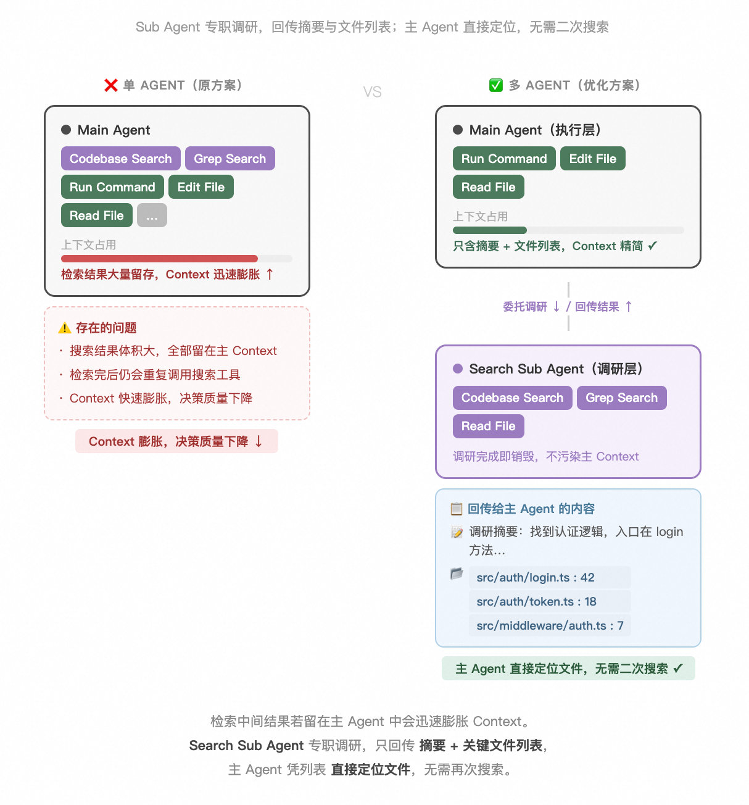

过去我们直接将额外提示追加到最后一条 Message 末尾。为了不破坏前缀，新方案将额外提示**单独作为一条 Message 追加到会话末尾**，并将 Cache 的点位打到倒数第二条 Message 里。每次新请求时，先移除上一轮的额外提示 Message，加入本轮信息后再重新追加。这样既能持续更新额外提示，又不会破坏前缀、不会累积重复文本，Prompt Cache 得以持续生效。

### 根据 Agent 执行轨迹排查 Token 使用热点

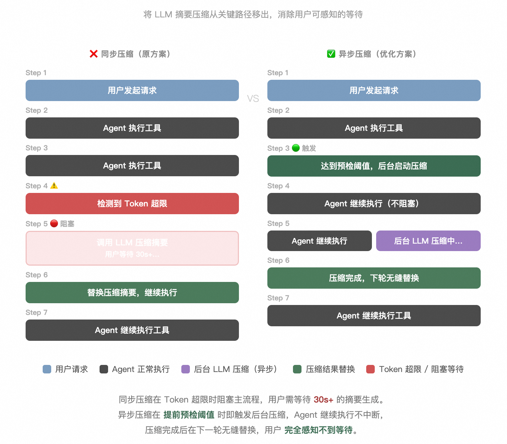

累积的重复文本信息是上下文用量膨胀的原因之一，但更大的原因是工具调用。我们使用了相同的任务在同类的竞品和 Copilot 上进行对比，结论是我们的 Token 膨胀速度会更快，排查了原因，大致有：

- **工具使用不当：** 有些高频的搜索工具如 Codebase Search 语义检索虽然定位速度很快，但返回的结果也特别多，在完成定位的情况下，后续仍然使用 Codebase Search 没有转向更精准、返回内容更少的 grep 工具，导致我们虽然比别的同类产品定位更快，但用的 Token 更多
- **历史债务：** 早期因为许多模型会过早结束调研阶段直接开始改代码，导致改的代码经常有各种各样的问题，于是加了许多读文件优先读取全文的提示，但随着 Agent 能力的变强，慢慢就不存在这个问题了，由于提示没改，依旧经常选择读取全文
- **部分工具存在极端情况：** 某些 MCP 之类的工具有可能一次性返回大量的文本，直接把整个上下文窗口用满

于是我们通过提示词优化，加了许多不同场景应该如何选择工具的提示，同时限制热点工具的最大 Token 使用量，并且对于返回大量文本的极端情况，也会直接把结果转写为本地的临时文件，让 Agent 使用 Read File 工具进行按行区间读取，或者直接对某些工具增加按行区间读取的改造，减缓 Token 用量的膨胀速度。

### 引入多 Agent 架构分离检索与执行

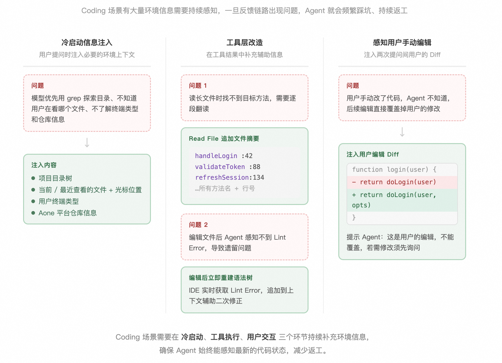

大部分 Token 消耗在检索阶段，而检索本身不需要特别强的模型，检索出的大部分内容最终也是无用的。基于此，我们尝试将检索和调研任务委托给子 Agent：子 Agent 完成调研后，输出一份信息总结和相关文件列表，主 Agent 据此直接定位所需文件，大幅减少检索工具的调用次数。同时，子 Agent 可以由成本更低的独立部署模型驱动，进一步降低成本。

围绕这一设想，我们推出了 **Sub Agent** 功能，主 Agent 可以自由调用子 Agent 完成各种任务，让需要大量检索和总结的场景变得更为高效。

### 会话压缩异步化

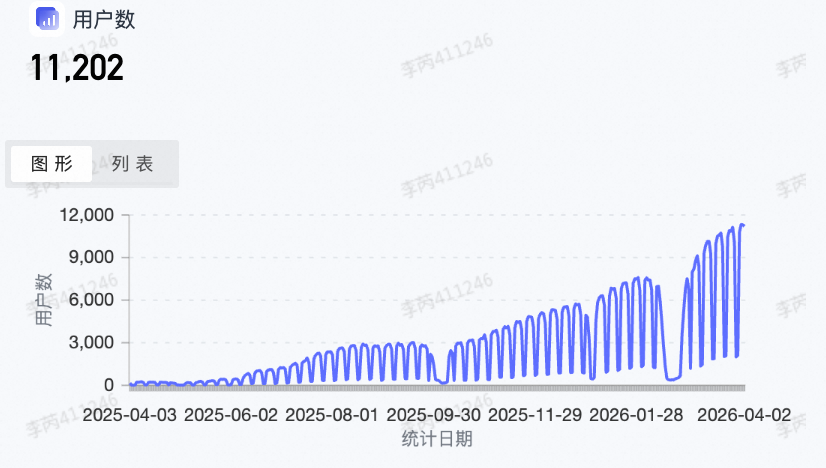

由于压缩的频次变高了，每次压缩的时间大约是 30s 左右，因此同步压缩非常影响使用体验，因而我们将压缩策略调整为**异步压缩**：

- 当当前的 Token 用量超过总上下文窗口的某个百分比阈值时，就会自动触发压缩任务，并记录当前最后一条 Message 的点位
- 当真正超过总窗口时，再将压缩任务的结果替换掉点位之前的 Message
- 这样在使用时就可以实现无感，无需阻塞等待

在压缩的过程中，我们也会着重保留一些信息：
- 用户手动引用的文件
- 已经被激活的 Skill
- Rules 信息
- 用户的原始输入信息

尽可能保持会话的连贯性。

---

通过这一系列改造，我们成功地将线上的**平均任务成本降低到了原来的 50% 左右，Cache Rate 长期接近 90%**，极大地缓解了成本压力。也正是因为这些工作，让 Aone Copilot Agent 在后续的持续增长里，有了更扎实的基础。

## 针对 Coding 场景的持续优化

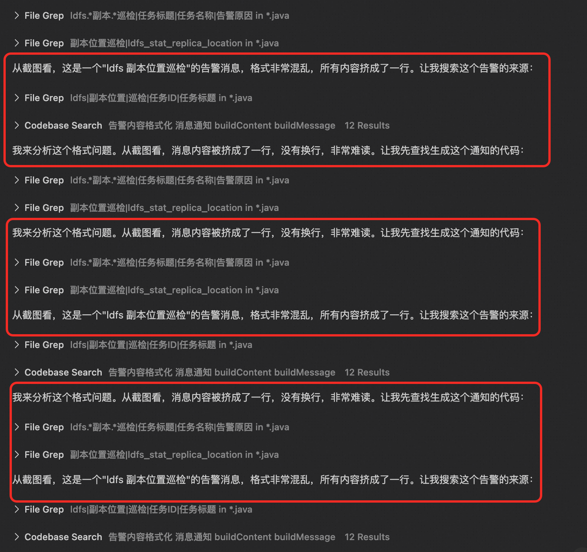

Coding 场景与其他场景非常不同的是，有大量的信息需要冷启动注入，而在 Agent 执行的过程中，也会持续产生新的信息，一旦这些环境信息反馈的链路出现问题，就会导致 Agent 频繁踩坑、持续返工。

比如我们早期发现有些模型会优先使用 grep 而非 ls、Codebase Search 等方式探索目录，导致早期几轮工具调用完全无效；或者无法感知到用户当前正在查看和打开的文件，没有办法理解用户口中的"这个文件"指的哪个，也不知道用户的终端类型、当前仓库对应集团 Aone 平台的哪个仓库等。对于这些问题，我们会在用户提问时，往上下文中注入：

- 项目的目录树信息
- 用户当前和最近查看的文件及光标位置
- 用户的终端类型
- 集团代码库的相关信息

在工具层面，针对 Coding 场景中的常见问题也做了相应改造：

- **Read File 工具：** 追加了文件摘要，包含文件中所有方法的名称及行号，解决读长文件时一次性找不到所需方法的问题
- **Lint Error 感知：** 修改文件后立即利用 IDE 本身的能力重建语法树，获取 Lint Error 信息辅助 Agent 进行二次修正

此外，在用户和 Agent 持续交互的过程中，用户往往会自己手动修正一些代码，如果 Agent 感知不到这些修改，就会以为之前的编辑出了问题，在后续的编辑中覆盖掉用户的改动。因此我们在上下文中注入了**用户在两次提问间手动编辑产生的 Diff 信息**，并提示 Agent 这是用户的编辑，不能轻易覆盖，如果要覆盖需要先进行询问。

## 用户增长中的一些观察

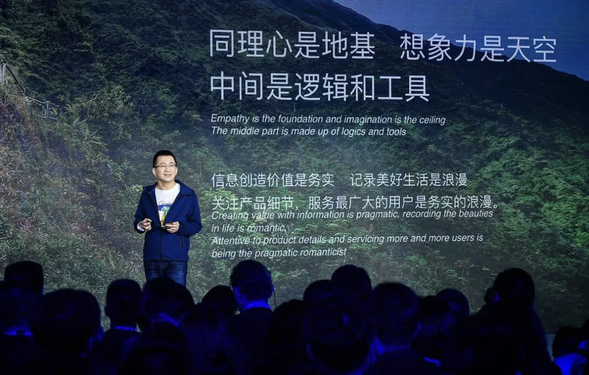

如今 Aone Copilot Agent 已成长为**日活 1w、月活 2w**的产品，远超最初预估的 3k 受众上限。之所以当时预估为 3k，是因为彼时使用代码会话功能的用户只有这么多，而 Agent 的使用门槛更高，加上早期模型能力和产品建设都不成熟，我们认为不会超过这个数字。但最终我们发现，日活从 0 到 3k 的增长用了 6 个月，而从 3k 到 1w 的增长也是 6 个月，说明用户对 Agent 的接纳程度越来越高，越来越多的人出于提效等目的开始主动接触 Agent 类产品，其中包括非研发序列的同学。

另一个有趣的观察是，春节后用户数、平均步数、任务成功率均在持续增长。背后的诱因有很多：我们上线了 Claude 4.5 Opus 模型，密集发布了 Skill、Plan 模式二期等面向长任务的 Feature。这也印证了一个**正循环**——更好的模型让 Agent 完成任务更高效准确，用户因此更有信心尝试更多、更复杂的长任务；反之，模型能力不足时用户不愿使用，容易陷入恶性循环。

## 结语

做成熟业务和做创新业务的逻辑不太一样。在高度不确定的环境里，我很少去预测长远的事情——这样做不靠谱且大概率是错的。这种环境更考验的是嗅觉是否灵敏、当下的判断是否明智，而目前 Coding Agent 业界正处于这样的环境之中。但至少从当前可以看到：长任务、并行化的任务执行是模型厂商和应用工程侧共同发力的方向，仍有许多可以进一步优化的空间。我们不妨设想，在接下来的一年里，长任务和并行化能达到怎样的自动化程度，当前的 Context Engineering 方案又会遇到哪些挑战，我们要如何迭代乃至重新设计已有的方案。

**国产旗舰模型和海外模型的差距仍然是 Context Engineering 面临的一大挑战。** 一套方案很难对所有模型都有好的效果，越强的模型如 Claude 系列往往对多种方案都能有较好的表现，而一些较为一般的旗舰模型则只对某一种方案有比较好的效果，对其他方案要么无法工作，要么极易出现死循环。一些前沿的 Feature 如按需读取 Skill，也仅对部分 SOTA 模型有好的效果，其余的旗舰模型经常会直接忽略 Skill 开始执行任务，或读取了很快就忘记。对于我们这样一个长期开发人数两只手能数清的小团队来讲，确实无力为不同模型兼容多种方案，因而在模型选型的过程中，也被迫放弃了一些口碑很好但无法兼容的模型，除了一些不能放弃的选择以外。

如今 AI 圈 Hype 的风气依然盛行，情绪一如 23 年年底。在外部压力持续增大、内部资源逐步减少的背景下，少数成功案例激起了更多人对 AI 这根救命稻草的期待。**有限的 AI 能力和人们对 AI 无限的期待，注定是一个长久的矛盾。** 张一鸣讲过，同理心是地基，想象力是天空，中间是逻辑和工具。唯有围绕真实的用户需求，承认当下的局限性，同时保持对未来的开放性，去构建当下真正可用的方案和产品，才是高度不确定环境下最行之有效的选择。毕竟 Coding Agent 产品的可选择性太多了，我们没办法做出一个 Feature 然后对用户说："现在不行，但也许以后模型变好了就行了。" 毕竟我们还是要坚持对自己的产品和用户负责。

凭此出发点，Aone Copilot 团队将竭尽所能，主动思考自身的过去和业界前沿的种种，并将我们所能提供的最好的努力应用于未来，更好地服务一直以来支持我们的用户。

---

> 此文 Aone Copilot Agent 亦有贡献，Aone Copilot 团队敬上。
